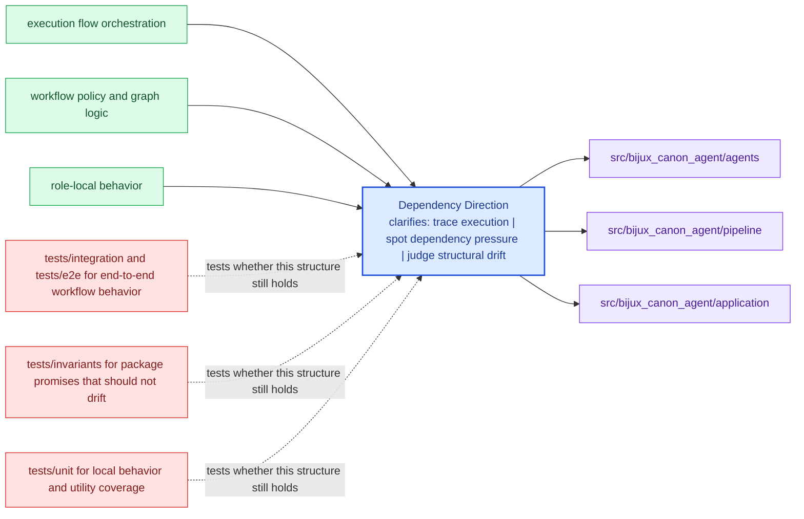

# Dependency Direction

The package should keep dependency direction readable: domain intent near the center,
interfaces and infrastructure at the edges.

This is not only an aesthetic preference. Clear dependency direction keeps
refactors cheaper because reviewers can still tell which layers are allowed to
know about which other layers.

Treat the architecture pages for `bijux-canon-agent` as a reviewer-facing map of structure and flow. They should shorten code reading, not try to replace it.

## Visual Summary

## Directional Reading Order

- domain and model concerns under the core module groups
- application orchestration that composes domain behavior
- interfaces, APIs, and adapters that sit at the boundary

## Concrete Anchors

- `src/bijux_canon_agent/agents` for role-local behavior
- `src/bijux_canon_agent/pipeline` for execution flow orchestration
- `src/bijux_canon_agent/application` for workflow policy and graph logic
- `src/bijux_canon_agent/llm` for LLM runtime integration support
- `src/bijux_canon_agent/interfaces` for CLI boundaries and operator helpers
- `src/bijux_canon_agent/traces` for trace-facing models and persistence helpers

## Concrete Anchors

- `src/bijux_canon_agent/agents` for role-local behavior
- `src/bijux_canon_agent/pipeline` for execution flow orchestration
- `src/bijux_canon_agent/application` for workflow policy and graph logic

## Use This Page When

- you are tracing structure, execution flow, or dependency pressure
- you need to understand how modules fit before refactoring
- you are reviewing design drift rather than one isolated bug

## Decision Rule

Use `Dependency Direction` to decide whether a structural change makes `bijux-canon-agent` easier or harder to explain in terms of modules, dependency direction, and execution flow. If the change works only because the design becomes harder to read, the safer answer is redesign rather than acceptance.

## What This Page Answers

- how `bijux-canon-agent` is organized internally in terms a reviewer can follow
- which modules carry the main execution and dependency story
- where structural drift would show up before it becomes expensive

## Reviewer Lens

- trace the described execution path through the named modules instead of trusting the diagram alone
- look for dependency direction or layering that now contradicts the documented seam
- verify that the structural risks named here still match the current code shape

## Honesty Boundary

This page describes the current structural model of `bijux-canon-agent`, but it does not guarantee that every import path or runtime path still obeys that model. Readers should treat it as a map that must stay aligned with code and tests, not as an authority above them.

## Next Checks

- move to interfaces when the review reaches a public or operator-facing seam
- move to operations when the concern becomes repeatable runtime behavior
- move to quality when you need proof that the documented structure is still protected

## Purpose

This page makes dependency direction explicit enough to review during refactors.

## Stability

Keep it aligned with current imports and directory responsibilities.
