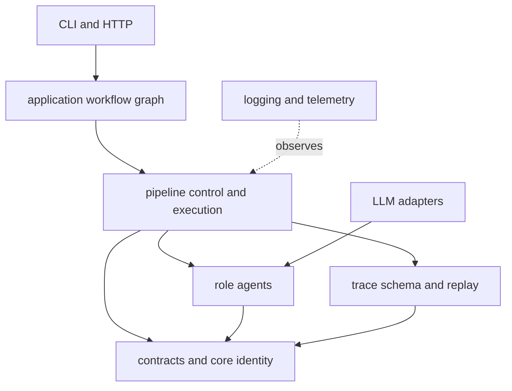

# Dependency Direction

Agent orchestration points inward toward immutable contracts, lifecycle rules,
and trace semantics. Provider SDKs, file readers, CLI parsing, HTTP models, and
logging remain replaceable edges rather than sources of pipeline authority.

```mermaid
flowchart TD
    cli["CLI and HTTP"] --> application["application workflow graph"]
    application --> pipeline["pipeline control and execution"]
    pipeline --> contracts["contracts and core identity"]
    roles["role agents"] --> contracts
    pipeline --> roles
    llm["LLM adapters"] --> roles
    traces["trace schema and replay"] --> contracts
    pipeline --> traces
    observability["logging and telemetry"] -. observes .-> pipeline
```

Lifecycle rules decide when a role may act. A provider adapter decides only how
an approved role invocation is performed.

## Contract Center

`contracts` owns immutable inputs, outputs, scores, metadata, execution plans,
retrieval shapes, and structured errors. `core` owns hashing, final-value
support, and version identity. These modules must not import provider SDKs,
filesystem readers, or delivery interfaces.

Contract validation happens before role execution. Unknown fields, blank
identifiers, invalid score ranges, and mismatched contract versions are caller
or integration defects, not model behaviors to repair in a prompt.

## Pipeline Authority

`pipeline.control`, `pipeline.execution`, `pipeline.convergence`,
`pipeline.results`, and `pipeline.trace_validation` own the canonical lifecycle,
budgets, stage scheduling, stop conditions, result construction, and evidence
requirements.

Role modules depend on these contracts but do not select their own lifecycle
transitions or terminal state. A verifier may return a veto; the controller
decides the permitted transition and records why the run stopped.

## Role and Provider Direction

Planner, reader, summarizer, critique, judge, validator, verifier, and stage
runner modules own bounded role behavior. `llm` resolves a declared model to a
provider adapter and records model metadata.

Provider output is untrusted role output until it satisfies the agent contract
and pipeline validation. An adapter may classify transport failure, but it may
not turn a veto into pass, change convergence thresholds, or label a trace
replayable.

## Application and Interface Direction

`application.workflow_graph` composes the canonical pipeline into higher-level
work. The CLI owns input-file resolution, YAML loading, environment bootstrap,
batch processing, replay commands, and artifact writing. The v1 API owns its
fixed offline request boundary.

Interfaces can choose transport status and output location. They must not
invent trace entries, bypass lifecycle validation, or broaden the configured
role and provider authority.

## Observation Direction

Observability receives structured run information from the pipeline. Logging,
metrics, and telemetry cannot steer role selection or acceptance. If a metric
changes control flow, it has become policy and belongs in an explicit pipeline
contract.

## Forbidden Reversals

- contracts importing OpenAI or another provider client;
- a role changing the controller's next lifecycle state;
- logging configuration changing result semantics;
- the CLI writing a successful final result from an unvalidated trace;
- runtime acceptance policy being embedded in an agent prompt.

Use the [module map](module-map.md) for ownership and
[integration seams](integration-seams.md) for boundary behavior.
