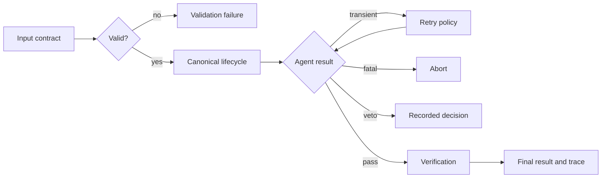
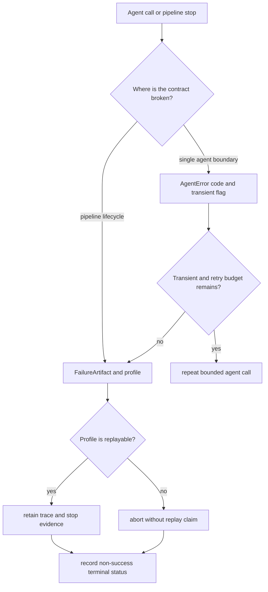

# Error Model

`bijux-canon-agent` keeps transport errors, contract violations, agent
failures, and pipeline decisions separate. A veto or a convergence stop is a
recorded outcome, not an untyped exception and not a successful approval.

## Contract failures

`AgentInput`, `AgentOutput`, and `AgentError` are frozen Pydantic models that
reject unknown fields. Inputs require a non-empty task goal and context
identifier. Outputs require non-empty text, confidence and score values between
zero and one, and the current contract version in metadata. Invalid values fail
at construction instead of entering the pipeline.

An `AgentError` carries a stable failure code, message, optional detail, and a
`transient` flag. The code taxonomy is:

| Code | Meaning | Normal disposition |
| --- | --- | --- |
| `TIMEOUT` | a bounded operation exceeded its deadline | retry only while policy allows |
| `TRANSIENT` | an operation may succeed without changing the request | retry with the configured delay |
| `VALIDATION_ERROR` | input or output does not satisfy its contract | correct the data; do not retry unchanged input |
| `FATAL` | execution cannot safely continue | abort the run |

The repository-managed failure policy can additionally classify security as a
critical abort code at the workflow-graph boundary.

## Pipeline Failure Artifacts

Pipeline failures use a separate, richer taxonomy because orchestration must
decide whether a run can retry, replay, or publish partial evidence. A
`FailureArtifact` records the class, detection mode, message, lifecycle phase,
recoverability, and whether the failure is operational or epistemic.

| Failure class | Category | Retryable | Replayable |
| --- | --- | --- | --- |
| `user_interruption` | operational | no | yes |
| `epistemic_uncertainty` | epistemic | no | yes |
| `verification_veto` | operational | no | yes |
| `budget_exceeded` | operational | no | yes |
| `max_iterations` | operational | no | yes |
| `fatal_failure` | operational | no | no |
| `execution_error` | operational | yes | no |
| `validation_error` | operational | no | yes |
| `resource_exhaustion` | operational | yes | no |

The profile is normative: every failure class has exactly one profile, the
artifact category must match it, and only a retryable class may be marked
recoverable. `recoverable` authorizes a policy decision; it does not guarantee
that the external model or tool call is idempotent.

An agent-level `transient` flag and a pipeline-level retryable profile answer
different questions. The former describes the failed call; the latter governs
the pipeline artifact after orchestration has considered lifecycle and policy.

## Lifecycle and decision failures

The canonical phase order is `INIT → PLAN → EXECUTE → JUDGE → VERIFY →
FINALIZE → DONE`; `ABORTED` is terminal. The controller rejects an invalid
transition. Trace validation also rejects missing phases, invalid ordering,
missing replay fields, or replayable model metadata with non-zero temperature.

`pass` and `veto` are the canonical decision values. A veto records an explicit
negative decision. It must not be converted to success merely because every
agent call returned normally. A run can also stop because of maximum
iterations, budget exhaustion, user interruption, convergence, verification
veto, or fatal failure; the stop reason belongs in the final status and trace.

## Boundary behavior

The CLI exits `2` for invalid or missing input paths and missing replay traces;
configuration, key validation, or unexpected execution errors exit `1`.
Successful results and dry-run artifacts remain machine-readable JSON.

The HTTP surface maps malformed JSON and schema failures to
`VALIDATION_ERROR` (`400`), execution and convergence failures to `422`, and
unexpected failures to `INTERNAL_ERROR` (`500`). Its response body carries the
stable code, message, and HTTP status. Consumers should branch on the code, not
parse message text.

Boundary translation must keep negative decisions and failures distinct. A
verification veto is a valid, replayable pipeline decision; an execution error
means the decision path did not finish. Both prevent a successful final result,
but only the veto can be interpreted as substantive judgment evidence.
