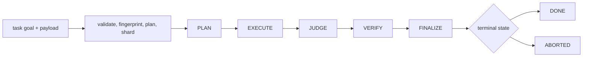
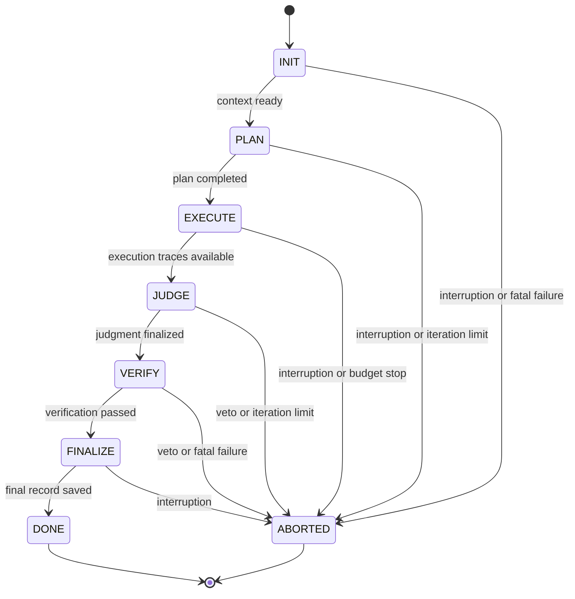

# Execution Model

`bijux-canon-agent` coordinates specialized agents through a governed pipeline.
The orchestration layer owns ordering, stop conditions, convergence, trace
requirements, and finalization; individual agents remain bounded executors.

## Canonical Lifecycle

The standard pipeline is named `auditable-doc-pipeline`. Its normal transition
order is `INIT → PLAN → EXECUTE → JUDGE → VERIFY → FINALIZE → DONE`.
`ABORTED` is a terminal path for interruption or fatal failure.

Lifecycle metadata constrains which agent types may act:

| Lifecycle | Principal owner | Exit evidence |
| --- | --- | --- |
| `PLAN` | planner | completed execution plan |
| `EXECUTE` | reader, summarizer, stage runner, critique | stage results and execution traces |
| `JUDGE` | judge | recorded judgment |
| `VERIFY` | verifier | verification result or veto |
| `FINALIZE` | orchestrator | saved final record |

The controller validates transitions instead of inferring order from whichever
agent returns first.

The normal lifecycle tuple excludes `ABORTED`; that state is an explicit
terminal diversion. Entry conditions, exit conditions, allowed agent roles,
and eligible stop reasons are declared per lifecycle state. A plugin cannot
gain authority merely by returning output that resembles a later phase.

## Preparation

Every run requires `task_goal`. A caller may supply `context_id`; otherwise it
is derived from the sorted input context. A cache key hashes all context fields
except `timestamp` and `nonce`, allowing observational timestamps to change
without invalidating equivalent work.

Preparation determines the required stages, shards large inputs, initializes
audit, revision, telemetry, warning, and status structures, and returns a cached
result when one exists. A cache hit is explicit in the result contract.

## Execution and Validation

Each shard runs the required stages and returns stage data, execution path,
audit trail, revisions, warnings, and terminal status. Shard results are merged
before the final result is extracted. A failed shard stops the current run and
produces the same structured failure shape as input or validation errors.

The merged result must pass goal-aware final validation before it can be
finalized. Validation issues do not disappear into logs: they change terminal
status, preserve warnings and an action plan, and prevent a successful result
from being cached.

## Custody Through a Run

The orchestration result keeps decision evidence together instead of returning
only generated text.

| Boundary | Custody established |
| --- | --- |
| preparation | task goal, context identity, configuration snapshot, required stages, shard plan |
| agent call | typed input, typed output or typed error, model and prompt metadata |
| shard completion | stage data, execution path, audit trail, revisions, warnings, terminal status |
| merge | ordered shard evidence and goal-aware validation inputs |
| finalization | final decision, confidence, epistemic verdict, stop reason, replay fingerprint, trace |

The final text is therefore one field in a governed result, not the run's sole
product. If a caller stores only that text, it discards the evidence needed to
distinguish a passed verification from a veto, a converged result from a budget
stop, or a fresh execution from a cache hit.

## Convergence and Termination

Convergence tracks confidence and verdict history. Strategies can recognize
stability, confidence-only convergence, score behavior, and oscillation. The
chosen reason, decision type, iteration count, and convergence-window hash are
retained for replay.

Execution termination is classified as completed, convergence, failure, user
abort, or resource exhaustion. This is distinct from a role's pass/veto
decision: one explains why orchestration stopped, while the other records the
substantive decision.

## Finalization

Successful finalization closes telemetry, records pipeline counters, updates
the cache, persists the full pipeline result, and emits final result and trace
artifacts at the CLI boundary. A final result is derived back from its trace
before publication so decision, confidence, epistemic verdict, and stop reason
share one source.

The replay fingerprint covers the pipeline definition, contract version, and
configuration snapshot. Trace metadata separately retains prompt, model,
runtime, convergence, and input identity. Replayability requires deterministic
model settings, including zero temperature.

A completed agent call does not authorize finalization. The merged pipeline
must reach `FINALIZE`, pass goal-aware validation, and produce the required
trace-derived result. Conversely, an `ABORTED` run can retain valuable audit
and failure artifacts while remaining ineligible for publication as `DONE`.

See [Data Contracts](../interfaces/data-contracts.md) for boundary shapes and
[Observability and Diagnostics](../operations/observability-and-diagnostics.md)
for evidence-led investigation.
