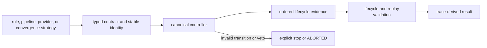

# Extensibility Model

Agent extensions add bounded role behavior, a declared pipeline composition,
a provider adapter, or a convergence strategy. The controller continues to own
transitions, retries, termination, trace completeness, and finalization.

## Extension path

Extensions participate in orchestration; they do not acquire orchestration
authority by being called from it.

## Role extensions

A new role derives from the bounded agent contract and implements its payload
logic. It must:

- accept normalized typed context through the execution kernel;
- emit a typed output or structured failure without changing controller state;
- declare stable name, version, capabilities, schema, and coverage;
- keep initialization and cleanup resource ownership explicit;
- support feedback-driven revision without hiding the original attempt;
- remain passive: it cannot advance lifecycle, finalize the run, or overwrite
  another role's evidence.

Register the role only in pipeline compositions that declare where it may act.
A class existing under `agents/` does not automatically expand the canonical
role set or HTTP v1 behavior.

## Pipeline extensions

`PipelineDefinition` declares a stable name, ordered phases, terminal phases,
allowed transitions, and documented skip reasons. A new composition must bind
roles to phases, define retry and feedback behavior, identify every terminal
path, and produce a definition hash retained in the trace.

Changing phase order, transition authority, terminal meaning, or skip behavior
changes the public execution contract. Historical traces remain interpreted
against the definition they recorded, not the current default.

## Provider extensions

A provider adapter or custom LLM backend must expose:

- stable provider, backend, model, and implementation identity;
- actual temperature, token limits, request parameters, and usage;
- prompt and model hashes required by trace validation;
- classified timeout, authentication, quota, transport, and provider failures;
- bounded retry behavior controlled by pipeline policy;
- secret-safe metadata and a cleanup lifecycle.

Zero temperature is required for a trace to claim replayability, but it is not
sufficient by itself. Provider/runtime versions, prompts, configuration,
pipeline definition, convergence window, and input identity must also match.
Replay reconstructs from recorded trace data; it does not call the provider.

## Convergence extensions

A convergence strategy returns a typed decision with reason, iteration state,
confidence/verdict history, and a stable convergence-window hash. It must
distinguish convergence from the substantive role verdict and from execution
termination. Oscillation, exhaustion, veto, and failure cannot be collapsed
into a generic successful stop.

## Interface boundaries

Adding a Python extension does not expand HTTP v1. The current API uses the
fixed offline `simple` backend, `extractive` strategy, and canonical agent
list, even though requests accept a narrow configuration object. Expanding
that surface requires a versioned schema, explicit selection policy, security
review, and contract tests.

The [execution model](execution-model.md) defines controller authority. The
[configuration surface](../interfaces/configuration-surface.md) identifies the
settings and hashes an extension must preserve.
