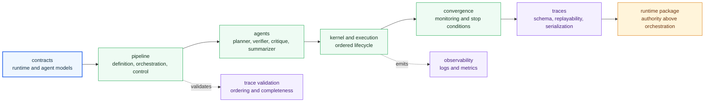

# Architecture

Open this section when the question is structural: where orchestration lives, how roles and steps coordinate, and how the package keeps workflows traceable instead of magical.

## Structural Shape

Agent architecture is organized around traceable workflow control. Pipeline
definitions describe the work, role modules perform bounded decisions, the
execution kernel orders calls, convergence logic decides whether work is done,
and trace modules make the sequence inspectable by runtime and reviewers.

## Read These First

- open [Module Map](https://bijux.io/bijux-canon/05-bijux-canon-agent/architecture/module-map/) first when you need the owning code area for a workflow concern
- open [Execution Model](https://bijux.io/bijux-canon/05-bijux-canon-agent/architecture/execution-model/) when you need the real path from workflow input to trace-backed output
- open [Integration Seams](https://bijux.io/bijux-canon/05-bijux-canon-agent/architecture/integration-seams/) when a change could pull reasoning or runtime authority into orchestration

## Structural Risk

The main architectural risk here is letting workflow control become so distributed that a reader can no longer tell which module made a role or sequencing decision.

## First Proof Check

- `packages/bijux-canon-agent/src/bijux_canon_agent/pipeline` for workflow definition, orchestration, control, and convergence
- `packages/bijux-canon-agent/src/bijux_canon_agent/agents` for role implementations and their bounded responsibilities
- `packages/bijux-canon-agent/src/bijux_canon_agent/traces` for trace serialization and replayability
- `packages/bijux-canon-agent/tests` for determinism and traceability evidence

## Pages In This Section

- [Module Map](https://bijux.io/bijux-canon/05-bijux-canon-agent/architecture/module-map/)
- [Dependency Direction](https://bijux.io/bijux-canon/05-bijux-canon-agent/architecture/dependency-direction/)
- [Execution Model](https://bijux.io/bijux-canon/05-bijux-canon-agent/architecture/execution-model/)
- [State and Persistence](https://bijux.io/bijux-canon/05-bijux-canon-agent/architecture/state-and-persistence/)
- [Integration Seams](https://bijux.io/bijux-canon/05-bijux-canon-agent/architecture/integration-seams/)
- [Error Model](https://bijux.io/bijux-canon/05-bijux-canon-agent/architecture/error-model/)
- [Extensibility Model](https://bijux.io/bijux-canon/05-bijux-canon-agent/architecture/extensibility-model/)
- [Code Navigation](https://bijux.io/bijux-canon/05-bijux-canon-agent/architecture/code-navigation/)
- [Architecture Risks](https://bijux.io/bijux-canon/05-bijux-canon-agent/architecture/architecture-risks/)

## Leave This Section When

- leave for [Interfaces](https://bijux.io/bijux-canon/05-bijux-canon-agent/interfaces/) when the structural question is already a public contract question
- leave for [Operations](https://bijux.io/bijux-canon/05-bijux-canon-agent/operations/) when the issue is running, diagnosing, or releasing the package rather than explaining its shape
- leave for [Quality](https://bijux.io/bijux-canon/05-bijux-canon-agent/quality/) when the structure is clear and the real question is whether the package has proved it strongly enough

## Bottom Line

A structure that cannot be explained in one pass is already carrying too much hidden policy.
