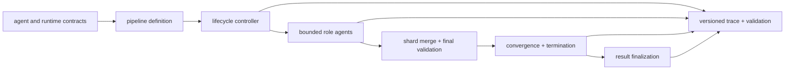
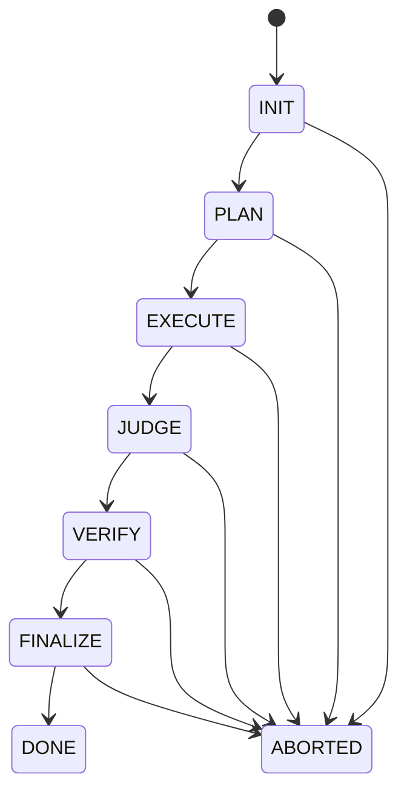

# Architecture

The agent architecture separates workflow definition, lifecycle control,
bounded role execution, convergence, result finalization, and trace validation.
That separation makes the actor and reason for every transition recoverable
after execution.

## Control structure

```mermaid
flowchart LR
    contracts["agent and runtime contracts"]
    definition["pipeline definition"]
    controller["lifecycle controller"]
    roles["bounded role agents"]
    merge["shard merge + final validation"]
    convergence["convergence + termination"]
    results["result finalization"]
    trace["versioned trace + validation"]

    contracts --> definition --> controller --> roles --> merge --> convergence --> results
    controller --> trace
    roles --> trace
    convergence --> trace
    results --> trace
```

## Canonical lifecycle

```mermaid
stateDiagram-v2
    [*] --> INIT
    INIT --> PLAN
    PLAN --> EXECUTE
    EXECUTE --> JUDGE
    JUDGE --> VERIFY
    VERIFY --> FINALIZE
    FINALIZE --> DONE
    INIT --> ABORTED
    PLAN --> ABORTED
    EXECUTE --> ABORTED
    JUDGE --> ABORTED
    VERIFY --> ABORTED
    FINALIZE --> ABORTED
```

The controller validates these transitions. It does not infer lifecycle order
from completion timing. Large inputs may be sharded, but shard outputs are
merged and validated before publication; a failed shard produces the same
structured failure contract as other governed failures.

## Module authority

| Area | Authority |
| --- | --- |
| `contracts` | immutable role, plan, retrieval, and runtime boundary models |
| `pipeline/definition.py` and `pipeline/agent_registry.py` | declared workflow shape and eligible roles |
| `pipeline/control` and `pipeline/execution` | lifecycle, stop conditions, iteration, sharding, and telemetry |
| `agents` | bounded implementations for reader, summarizer, critique, validator, planner, judge, verifier, and stage runner |
| `pipeline/convergence` and `pipeline/termination.py` | stability evidence, oscillation, stop reasons, and terminal classification |
| `pipeline/results` | merge, failure, completeness, decision, and final projection |
| `traces` and `pipeline/trace_validation` | schema evolution, replayability, ordering, completeness, and epistemic validation |
| `llm` | provider registry and adapter boundary outside deterministic orchestration |
| `observability` | structured logs, counters, timings, and callbacks |

## Identity and replay

Equivalent context keys exclude observational `timestamp` and `nonce`, while
configuration, pipeline definition, prompts, model identity, convergence, and
input hashes remain evidence-bearing. A successful result is projected back
from its trace so decision, confidence, epistemic verdict, and stop reason have
one source.

Replay validates and reconstructs stored outcomes. It cannot recreate an
external provider's past environment, and the current CLI parity check covers
only a documented subset of the full trace contract.

## Navigate the design

| Need | Guide |
| --- | --- |
| Locate a workflow or role owner | [Module map](module-map.md) and [Code navigation](code-navigation.md) |
| Follow preparation through finalization | [Execution model](execution-model.md) |
| Understand allowed dependency direction | [Dependency direction](dependency-direction.md) |
| Distinguish cache, result, trace, and log state | [State and persistence](state-and-persistence.md) |
| Add a role, provider, or workflow seam | [Integration seams](integration-seams.md) and [Extensibility model](extensibility-model.md) |
| Trace veto, abort, failure, and resource exhaustion | [Error model](error-model.md) |
| Review structural failure modes | [Architecture risks](architecture-risks.md) |
