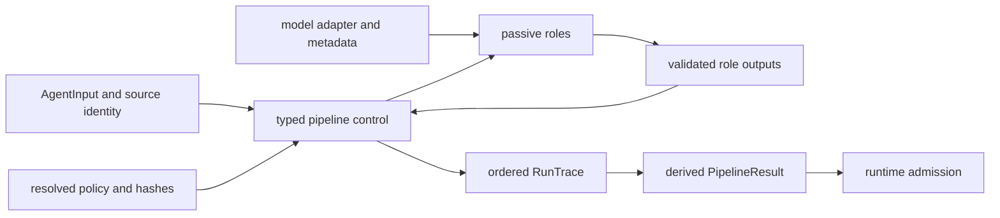
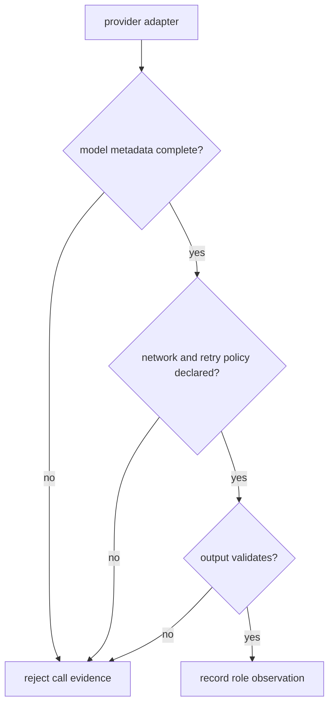

# Integration Seams

Agent integrations cross content, control, provider, artifact, and runtime
boundaries. These seams must remain separate: a model adapter supplies role
content, while typed orchestration owns lifecycle authority. A convenient
provider or CLI wrapper must not become hidden approval policy.

## Orchestration Handoff

The feedback edge carries observations, not authority. Roles cannot select
their own transitions, erase vetoes, or declare terminal success outside typed
control.

## Seam Contracts

| Seam | Required input | Agent produces | Refusal boundary |
| --- | --- | --- | --- |
| task input | immutable task goal, payload, context, source identity, execution mode | normalized `AgentInput` and attempt identity | changed bytes or meaning under reused identity |
| configuration | YAML plus explicit overrides | resolved limits, retry, feedback, logging and model configuration with hashes | untracked override or invalid policy |
| provider | declared model adapter, credentials, timeout and metadata | schema-validated role output and actual model metadata | authentication, rate limit, timeout, provider or schema failure |
| controller | valid input, resolved policy, passive role observations | lifecycle transitions, convergence, veto, stop and termination states | forbidden transition or incompatible terminal state |
| trace/result | complete ordered trace and derived public fields | `run_trace.json` and `final_result.json` | missing mandatory field, schema failure, or parity mismatch |
| runtime | full agent evidence and authority-neutral result | no implicit run acceptance | runtime policy rejects or cannot establish complete custody |

## Input And Configuration Identity

In-process callers construct `AgentInput` values. The CLI resolves a file or
directory and applies the configured task goal to selected inputs. If source
bytes, task meaning, or material context changes, issue a new identity; do not
reuse cached, comparable, or replayable labels from the earlier attempt.

Configuration precedence is constructor parameters, pipeline parameters,
top-level values, then defaults. Archive the resolved configuration and its
hash. Retaining source YAML alone loses command-line and constructor overrides.
The recorded provider, model, temperature, and token limit must describe the
actual call, not only the intended configuration.

## Provider Admission

Provider adapters expose authentication, network, timeout, rate-limit, version,
and retry failure domains. A retry policy must distinguish transient reads from
effects that cannot safely repeat.

The CLI currently requires OpenAI, Anthropic, HuggingFace, and DeepSeek keys
before command dispatch, including offline-oriented commands. This bootstrap
constraint does not mean a workflow executes all four providers.

## CLI, HTTP, And Replay

A successful non-dry CLI run writes `result/final_result.json` and
`trace/run_trace.json`. They are separate writes without a manifest or
transactional completion marker. Directory execution may process multiple
files while the primary artifact reflects the first successful entry. Batch
consumers must retain every per-file outcome and reconcile the full input set.

The HTTP application exposes a fixed deterministic offline
`simple`/`extractive` pipeline. Its narrow configuration schema does not grant
arbitrary role, provider, backend, or model selection. It is a distinct
integration posture from the provider-backed CLI.

Replay upgrades and validates the stored trace, reconstructs the public result,
and compares the adjacent result when available. It does not call providers.
Non-zero temperature and incomplete replay identity restrict replayability.

## Runtime Admission

Runtime needs input and task identity, resolved configuration, pipeline hash,
model metadata, complete trace, per-input outcomes, convergence and termination
state, and final result. It may accept, reject, and persist the wider run; it
must not rewrite agent history, turn interruption into completion, or convert a
verification veto into success.

For the installed local research path, Runtime supplies an
`InstalledResearchPort` that exposes Reason planning/convergence and persistent
Index retrieval. `InstalledResearchService` combines the plan with its
content-addressed observed state and selects actions from explicit guards. A
satisfied no-search state, a bounded no-result search, material opposition,
ambiguous evidence, unclassified candidates, and tool failure therefore do not
emit the same role sequence. This keeps evidence semantics in Reason,
retrieval semantics in Index, workflow decisions in Agent, and durable
artifact/run custody in Runtime. Runtime may serialize the returned state and
events into its versioned artifact, but it must not synthesize missing Agent
events or promote a blocking gap to completion.

See [configuration](../interfaces/configuration-surface.md) for precedence and
[artifact contracts](../interfaces/artifact-contracts.md) for evidence fields.
