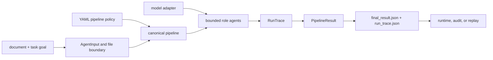

# Integration Seams

Agent integrations cross five distinct boundaries: task input, pipeline
configuration, provider execution, trace/result artifacts, and downstream run
authority. Keeping them distinct prevents a convenient adapter from becoming
hidden orchestration policy.

## Seam Map

## Input Seam

In-process integrations construct immutable `AgentInput` values with a task
goal, payload, context identity, agent type, and execution mode. The CLI accepts
a file or directory, resolves supported documents, and applies one configured
task goal across the selected inputs.

Input identity must remain stable outside observational timestamp and nonce
fields. If file bytes, task meaning, or material context change, use a new
identity and do not reuse cached or replay labels from the earlier work.

## Configuration Seam

YAML supplies pipeline limits, retry policy, feedback rules, logging, and model
metadata. Constructor parameters take precedence over pipeline parameters,
then top-level values, then defaults. Preserve the resolved configuration and
its hash with a delivered trace; retaining only the source YAML can miss
overrides.

Model metadata is part of trace validity. Provider, model name, temperature,
and token limits must describe the execution that actually occurred.

## Provider Seam

`llm.adapter_factory` maps declared models to provider adapters. Adapters return
role outputs and model metadata through the package contract. They also expose
network, authentication, rate-limit, timeout, and provider-version failure
domains that pipeline retry policy must classify explicitly.

The current CLI requires OpenAI, Anthropic, HuggingFace, and DeepSeek keys
before parsing any command, even when a local or single-provider workflow is
selected. This is a CLI bootstrap constraint, not a four-provider execution
contract.

## CLI Artifact Seam

A successful non-dry run writes `result/final_result.json` and
`trace/run_trace.json` under the caller's output root. The result is derived
from the trace and stores a relative trace path. The files are written
separately and have no manifest or transactional completion marker.

Directory execution can process several files, while the final artifact uses
the first successful entry as its primary result. Batch integrations must also
retain per-file success and failure reporting; one primary result does not
summarize every input.

## HTTP Seam

The v1 ASGI factory exposes a fixed deterministic offline
`simple`/`extractive` pipeline. Although the schema accepts a narrow config
object, clients do not gain arbitrary role, provider, backend, or model
selection. The API is a separate integration posture from the provider-backed
CLI.

## Replay Seam

Replay loads and upgrades trace schema, validates replay fields, reconstructs
the public result, and compares an adjacent final result when available. It
does not call providers again. A trace using non-zero temperature cannot claim
deterministic replayability.

## Downstream Runtime Seam

Runtime should receive task and input identity, resolved configuration hash,
pipeline-definition hash, model metadata, complete trace, convergence and
termination state, and final result. It may apply broader acceptance and
persistence policy, but it must not rewrite agent history or convert an agent
veto into success.

See [configuration](../interfaces/configuration-surface.md) and
[artifact contracts](../interfaces/artifact-contracts.md) for concrete fields.
