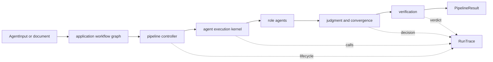
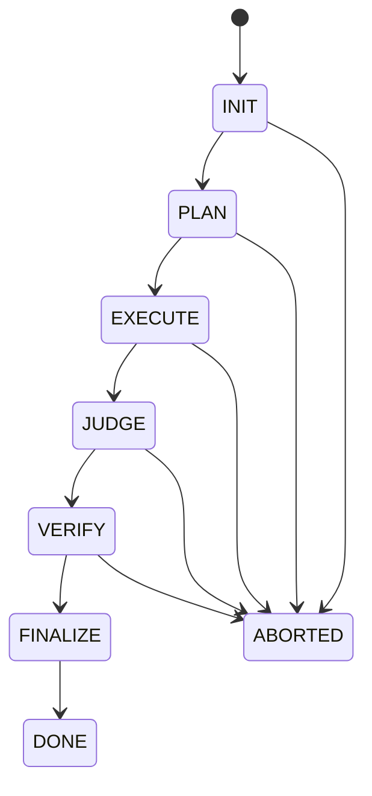

# Module Map

`bijux-canon-agent` owns a trace-backed agent pipeline with explicit roles,
lifecycle transitions, convergence, and termination. It keeps orchestration
decisions visible so a final result can be reconstructed from the execution
record instead of trusted as an opaque model response.

## Ownership by module

| Module | Owns | Use it when |
| --- | --- | --- |
| `contracts` | Immutable agent inputs, outputs, scores, metadata, and failures | Defining a role boundary or validating a result |
| `agents.kernel` | Ordered role execution and lifecycle callbacks | Coordinating agent calls without embedding pipeline policy in a role |
| `agents.*` | Planner, reader, summarizer, critique, judge, validator, verifier, and stage-runner behavior | Changing one role's local responsibility |
| `pipeline.control` | Canonical lifecycle, transition controller, stop conditions, and budgets | Governing when execution may advance or stop |
| `pipeline.execution` | Stage scheduling and execution support | Applying the pipeline definition to work |
| `pipeline.convergence` | Stability windows, strategies, snapshots, and convergence hashes | Deciding whether another iteration is justified |
| `pipeline.results` | Final outcome assembly from trace evidence | Reconstructing verdict, confidence, and failure state |
| `pipeline.trace_validation` | Ordering, replay, semantic, and epistemic trace checks | Rejecting incomplete or contradictory traces |
| `application.workflow_graph` | Higher-level workflow state and graph execution | Composing the canonical pipeline as an application use case |
| `traces` | Trace schema, entries, fingerprints, model metadata, upgrades, and replayability | Persisting or replaying an agent record |
| `llm` | Provider selection and model adapters | Connecting role execution to a declared model provider |
| `interfaces.cli` | File and directory execution, configuration, replay, and result artifacts | Operating the package from a shell |
| `api.v1` | Offline deterministic HTTP execution and strict request/response schemas | Embedding the canonical pipeline behind an ASGI boundary |
| `observability` | Structured logs and telemetry | Observing runs without changing lifecycle decisions |

## Canonical lifecycle

`DONE` and `ABORTED` are terminal. Each phase declares entry conditions, exit
conditions, allowed roles, and valid stop reasons. A veto, exhausted budget,
fatal failure, or user interruption remains distinguishable from successful
convergence.

## Contract and trace invariants

`AgentInput` and `AgentOutput` reject unknown fields and are immutable after
validation. Scores and confidence are bounded to `[0, 1]`. Every output must
carry the current contract version. Replayable traces record input, config,
model, prompt, pipeline-definition, and convergence identity; a non-zero model
temperature cannot be labeled replayable.

Trace completion is stronger than reaching the last function call. The trace
must satisfy phase order, mandatory evidence, finalization, epistemic status,
and replay metadata checks before its result is considered complete.

## Package boundaries

Reason owns evidence-backed claim formation. Agent owns iterative role
coordination, judgment, convergence, and termination around a task. Runtime
owns broader execution authority, persistence, and replay acceptance. Provider
adapters remain subordinate to the agent contract and never become
cross-package policy.

## Source and proof

- [`pipeline`](https://github.com/bijux/bijux-canon/tree/main/packages/bijux-canon-agent/src/bijux_canon_agent/pipeline) defines lifecycle, convergence, execution, and result semantics.
- [`agents`](https://github.com/bijux/bijux-canon/tree/main/packages/bijux-canon-agent/src/bijux_canon_agent/agents) contains role-local behavior and the execution kernel.
- [`traces`](https://github.com/bijux/bijux-canon/tree/main/packages/bijux-canon-agent/src/bijux_canon_agent/traces) owns durable trace models and replay metadata.
- [`tests`](https://github.com/bijux/bijux-canon/tree/main/packages/bijux-canon-agent/tests) covers lifecycle, convergence, determinism, trace validation, and CLI/HTTP parity.
