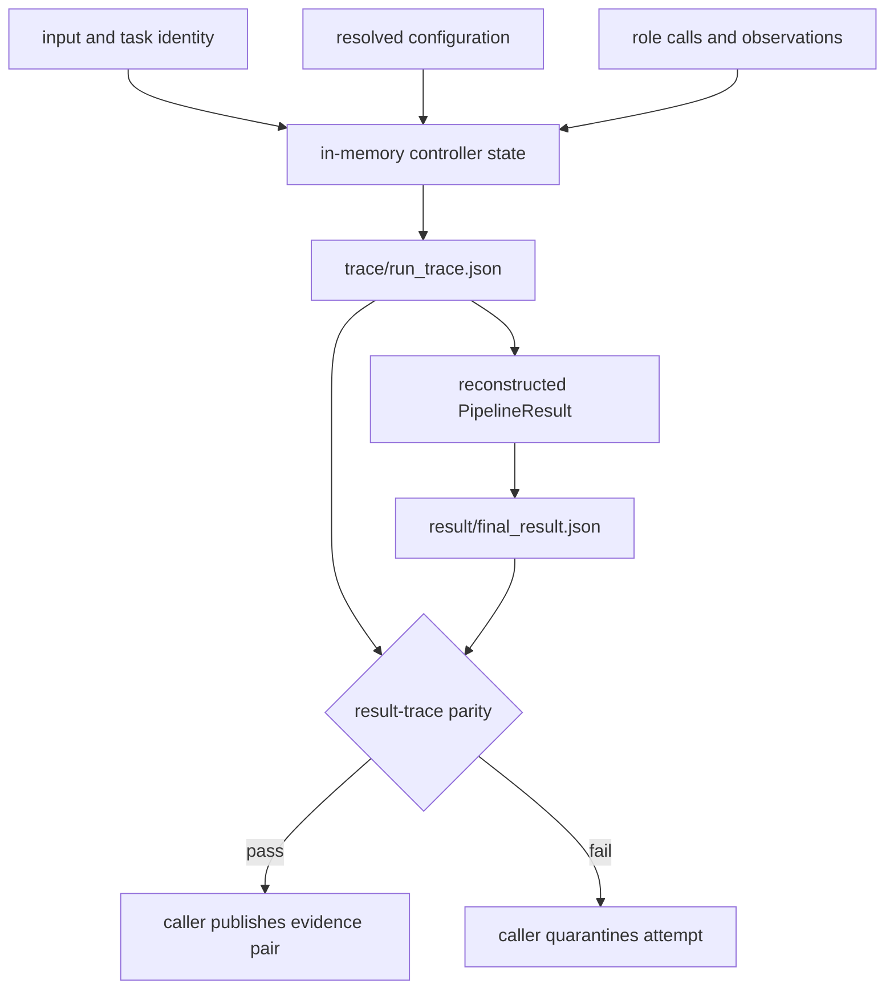
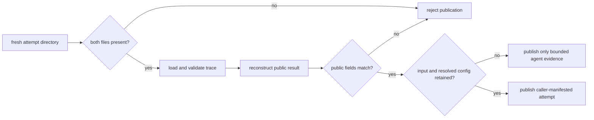

# State and Persistence

Agent keeps pipeline state in memory and writes a compact evidence pair at the
CLI boundary. The caller owns the output root. There is no global run database,
manifest, multi-writer coordination, or atomic directory commit.

## State Lifecycle



For `--out <output-root>`, a successful non-dry run writes:

```text
<output-root>/
├── result/
│   └── final_result.json
└── trace/
    └── run_trace.json
```

Keep the relative layout intact because the final result references the trace
relative to the output root.

## Durable Evidence

| Artifact | Carries | Does not carry automatically |
| --- | --- | --- |
| `run_trace.json` | schema, run identity, hashes, model metadata, ordered entries, replay data, convergence, failures, terminal status | source file bytes, resolved YAML as a standalone file, external provider environment |
| `final_result.json` | verdict, confidence, epistemic status, stop and termination reasons, convergence, runtime version, model metadata, trace path | complete per-file batch summary or independent derivation history |

Dry-run or no-success output records a veto-shaped result without a trace path.
It must not be presented as completed provider execution.

## Publication Is Caller-Owned

The two files use ordinary separate writes. Process interruption can leave one
missing or partially written. Reusing a directory can combine a result from one
attempt with a trace from another.



Use a fresh output directory for every material attempt. Before publication,
require both files, validate the trace, reconstruct `PipelineResult`, compare it
with the final result, and bind the pair to input digest, task identity, resolved
configuration, and attempt identity in the caller's manifest.

## Batch State

Directory execution can yield several per-file successes and failures while
the primary final artifact represents the first successful entry. A batch
publisher must preserve a typed outcome for every selected input, reconcile
selected, successful, failed, skipped, and missing counts, and keep each
artifact pair associated with its input identity. The primary result is not a
batch completion signal.

## Replay And Correction

Replay derives state from recorded entries after schema validation and declared
upgrade mappings. When the adjacent final result exists, replay compares public
fields and classifies mismatch. It does not repeat provider calls or prove that
unretained source bytes are unchanged.

Never edit a trace to make a result pass parity. Preserve the failed pair, run a
new attempt in a fresh directory, and link the replacement in caller-owned
publication metadata.

## Retention And Access

Traces can contain prompts, model outputs, failure details, and
document-derived content. Apply classification, encryption, access control,
retention, deletion, and backup to the complete attempt directory. Logs are
diagnostics and do not substitute for the structured trace.

See [artifact contracts](../interfaces/artifact-contracts.md) for field
semantics and [failure recovery](../operations/failure-recovery.md) for partial
output handling.
