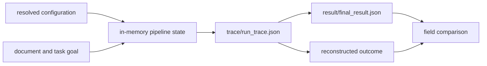

# State and Persistence

Agent keeps working state in memory while the pipeline runs and writes a small
durable evidence set at the CLI boundary. The caller chooses the output root;
the package does not maintain a global run database.

## Artifact Layout

For `--out <output-root>`, a successful non-dry run produces:

```text
<output-root>/
├── result/
│   └── final_result.json
└── trace/
    └── run_trace.json
```



The final result stores its trace path relative to the output root. Keep the
directory structure intact when moving or archiving the evidence pair.

## Durable Fields

`run_trace.json` carries the trace schema version, run identity and timestamps,
pipeline and configuration hashes, model metadata, ordered entries, replay
metadata, convergence state, failures, and terminal status.

`final_result.json` carries the derived verdict, confidence, epistemic status,
stop and termination reasons, convergence fields, runtime version, model
metadata, and relative trace path. In a dry run or when no successful entry is
available, the final result records a veto-shaped outcome with no trace path;
it must not be presented as a completed provider execution.

## Write Guarantees and Limits

The two files are written separately with ordinary filesystem writes. There is
no run manifest, atomic directory commit, or transactional status marker. A
process interruption can therefore leave one file missing or partially
written, and reusing an output directory can mix evidence from different
attempts.

Use a fresh output directory for every material run. Before publishing a
result, require both files, load and validate the trace, reconstruct the
pipeline result, and compare it with `final_result.json`.

## Replay Is Reconstruction

Replay validates and upgrades the stored trace schema, then derives the outcome
from recorded entries. If an adjacent final result exists, it compares public
fields and classifies mismatches. Replay does not repeat provider calls or
prove that the source document is still unchanged unless the integration also
preserves and checks source identity.

A trace can be labeled replayable only when its required hashes and model
metadata exist and its recorded temperature is zero. Non-deterministic model
sampling must remain visible in replay status.

## Operational Storage Guidance

- Allocate one output root per input or batch execution.
- Store configuration and input digests alongside the evidence pair when the
  surrounding system needs complete provenance.
- Restrict trace access: prompts, model outputs, failures, and document-derived
  content may be sensitive.
- Do not edit a trace to repair a final result; preserve the failed pair and run
  again into a new directory.
- Treat logs as diagnostics, not a substitute for the structured trace.

The package does not define retention, encryption at rest, or multi-writer
coordination. Deployments must supply those controls around the caller-owned
output root.

See [artifact contracts](../interfaces/artifact-contracts.md) for field-level
details and [failure recovery](../operations/failure-recovery.md) for handling
partial output.
