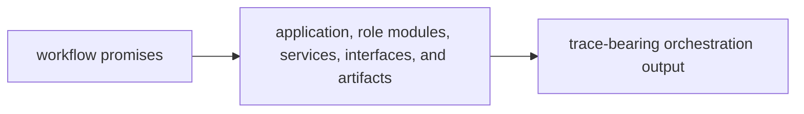

# Capability Map

The capability map for `bijux-canon-agent` should let a reviewer connect workflow promises to the code that coordinates roles and emits traces. If orchestration behavior cannot be mapped clearly, the package starts to look magical.

## Capability Flow

This page should show orchestration capability as something a reviewer can
locate, not something they have to trust. Workflow claims need a visible path
through modules and traces.

## Capability To Code

- `application/` and orchestration flows own role sequencing and workflow coordination
- agent services and role modules own the behavior of local actors inside a workflow
- `interfaces/` and artifacts own the surfaces where callers and operators inspect workflow behavior

## Visible Outputs

- trace-bearing workflow execution records
- role-specific outputs that remain attributable to a step and an order
- agent-facing contracts that expose orchestration intentionally

## Design Pressure

Agent capability starts to look magical when role coordination and trace output
cannot be tied back to named code areas. The package has to keep workflow
promises grounded in visible modules and artifacts.
