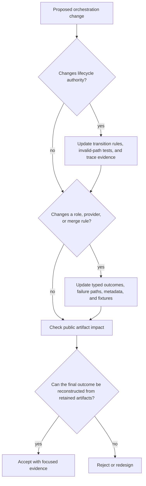

# Change Principles

Changes to `bijux-canon-agent` must preserve causal accountability: a reviewer
must be able to identify which role acted, under which configuration, what it
returned, which controller decision followed, and why execution stopped. New
providers, roles, or scheduling strategies are acceptable only when they remain
inside that record.

## Preserve lifecycle authority

Only the lifecycle controller may authorize phase transitions. Roles return
bounded results or typed errors; they must not mutate terminal state, erase a
veto, or skip required judgment and verification. Every new transition needs a
declared source, destination, guard, terminal effect, and trace representation.

Retries and fallbacks must remain visible. A retry budget, provider fallback,
or recovered role failure changes the causal record even when the final text is
unchanged.

## Preserve independent outcome signals

Keep decision, confidence, epistemic verdict, convergence, stop reason,
termination reason, and terminal status as separate fields. They must not be
derived from one another by convenience logic. In particular:

- convergence does not establish correctness;
- confidence does not override veto;
- `DONE` does not imply epistemic certainty;
- `ABORTED` does not describe why policy stopped the run; and
- a reconstructed result is not a replayed provider execution.

If a new strategy cannot express these signals honestly, extend the contract
before enabling the strategy.

## Preserve trace and result pairing

The ordered trace is the causal source for `final_result.json`. Changes to
trace entries, headers, configuration hashes, pipeline-definition hashes,
provider metadata, or model parameters require versioned serialization and
snapshot coverage. Observational fields may be excluded from deterministic
comparison only when they cannot affect control flow or substantive output.

The CLI writes fixed artifact names rather than an atomic content-addressed
bundle. Do not add implicit sharing between invocations; use isolated output
directories and make partial-output behavior explicit.

## Keep providers behind a bounded contract

Provider selection, credentials, model parameters, timeouts, usage, and errors
must be observable without leaking secrets into traces or logs. Provider output
is untrusted role input until the pipeline applies its normal judgment and
verification. A provider adapter must not acquire permission to alter lifecycle
state or runtime acceptance policy.

## Keep ownership in the right package

| Change concerns | Owning surface |
| --- | --- |
| source preparation or embedding | `bijux-canon-ingest` |
| retrieval ranking and backend capability | `bijux-canon-index` |
| evidence, claims, support, or reasoning verification | `bijux-canon-reason` |
| roles, handoffs, lifecycle, convergence, or provider invocation | `bijux-canon-agent` |
| whole-run admission, effects, persistence, or replay policy | `bijux-canon-runtime` |

Agent may carry another package's result through the workflow. Carrying an
artifact does not transfer authority to reinterpret it.

## Evidence expected with a change

| Changed surface | Minimum focused evidence |
| --- | --- |
| lifecycle transition | allowed-path, forbidden-path, abort, and terminal-state tests |
| role or handoff | typed success, veto, error, and serialization tests |
| provider adapter | configuration, secret-redaction, timeout, usage, and failure tests |
| convergence strategy | window, threshold, non-convergence, and false-stability fixtures |
| trace schema | deterministic snapshot, upgrade, and malformed-trace tests |
| finalization | trace-to-result parity and partial-output tests |
| CLI or HTTP surface | equivalent outcome fields and governed error tests |

Update examples and public artifact descriptions whenever a caller would see a
different outcome, field, stop reason, or file.

## Refuse the change when

- a role can advance the lifecycle without a controller decision;
- a veto, retry, fallback, or failure disappears from the trace;
- provider output is treated as verified because it is schema-valid;
- convergence is presented as evidence of correctness;
- credentials or sensitive input can enter retained telemetry;
- outcome reconstruction is described as provider replay;
- CLI and HTTP paths produce semantically different result records; or
- runtime admission policy is hidden inside orchestration.

A sound change leaves the workflow more capable while preserving who acted,
what governed the next action, and why the run ended.
