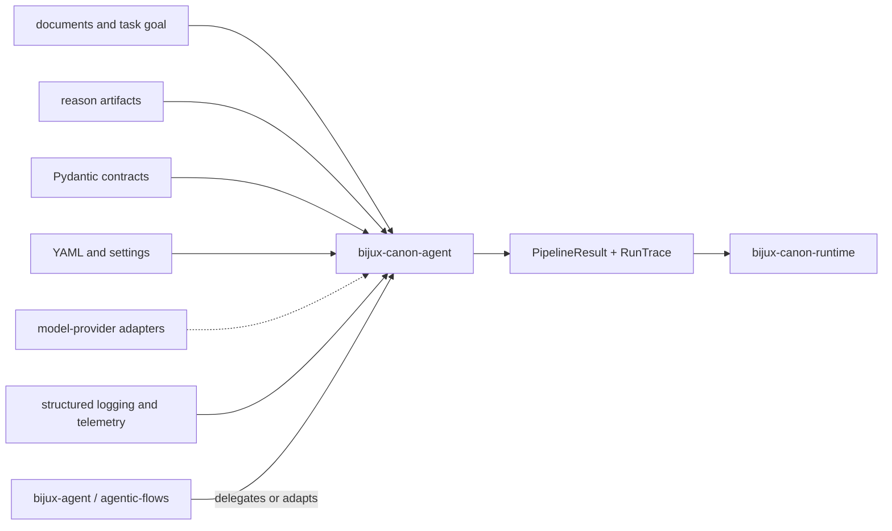

# Dependencies and Adjacencies

`bijux-canon-agent` owns role coordination, lifecycle progression,
convergence, termination, and the trace-derived workflow result. Dependencies
provide contracts, configuration, model access, logging, and transport. They do
not grant individual roles or providers authority over pipeline progression.

## Dependency shape

Provider edges are optional at execution time: the v1 HTTP application uses a
fixed offline pipeline, while the CLI can construct provider-backed adapters.

## Dependency roles

| Dependency family | Role | Boundary that remains explicit |
| --- | --- | --- |
| Pydantic and settings | Validate agent, pipeline, result, trace, and configuration data | Lifecycle and evidence semantics remain canonical package contracts |
| YAML | Declare pipeline policy, limits, feedback, logging, and model metadata | The resolved configuration and its hash, not only the source file, identify execution |
| model-provider clients and HTTP libraries | Invoke selected model backends | Provider/model identity, prompt hashes, usage, failures, and replay posture enter trace evidence |
| structured logging and telemetry | Emit operational observations | Logs do not replace ordered trace entries or decide the final verdict |
| cryptography and serialization helpers | Support controlled data handling | The CLI output directory currently has no package manifest or signature |
| Typer and FastAPI | Expose CLI and v1 HTTP boundaries | Each interface has a distinct configuration and provider posture |

## Canonical package adjacencies

### Reason

Reason supplies claims, supports, and verification evidence that an agent
workflow can coordinate or judge. Agent must retain reason artifact identity
and cannot reinterpret an unsupported claim as validated merely because a role
approved it.

### Runtime

Runtime governs the complete flow, persists authoritative execution evidence,
and applies final acceptance. Agent supplies its task/input identity, resolved
configuration hash, pipeline-definition hash, model metadata, trace,
convergence state, termination reason, and result. Runtime may reject that
evidence but must not rewrite it.

### Lower canonical packages

Ingest and index may be invoked as workflow activities. Their cleaning,
chunking, retrieval, budget, and replay semantics remain owned by those
packages. Agent owns when and why a role invokes work, not the scientific
meaning of a lower-layer result.

### Compatibility packages

Compatibility distributions preserve earlier imports and workflows. New role,
pipeline, trace, and result semantics begin in `bijux-canon-agent`; adapters
project those semantics without maintaining a competing lifecycle.

## Handoff contract

The dependable downstream unit is the result plus its complete trace:

- task goal, input identity, and material context identity;
- canonical pipeline name, definition hash, lifecycle, and allowed transitions;
- resolved policy, limits, feedback rules, and configuration hash;
- ordered role calls, outputs, failures, revisions, scores, and decisions;
- provider, model, temperature, token posture, prompts, and model hashes;
- convergence decision, window hash, stop reason, and termination reason;
- verdict, confidence, epistemic state, runtime version, and trace path.

See [integration seams](../architecture/integration-seams.md) for interface
differences and [artifact contracts](../interfaces/artifact-contracts.md) for
publication and replay limits.
