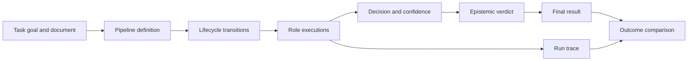

# Domain Language

`bijux-canon-agent` owns the ordered coordination of document-processing
roles. It records how a task moved through planning, execution, judgment,
verification, and finalization; it does not redefine the retrieval or reasoning
contracts owned by other packages.

## Orchestration

| Term | Exact meaning |
| --- | --- |
| task goal | The instruction applied to one input file. A directory run applies the same goal to each immediate file. |
| pipeline | The configured document workflow that coordinates roles, retries, thresholds, and finalization. |
| pipeline definition | The named phase graph and its allowed transitions. The canonical definition is `auditable-doc-pipeline`. |
| lifecycle phase | One of `INIT`, `PLAN`, `EXECUTE`, `JUDGE`, `VERIFY`, `FINALIZE`, `DONE`, or `ABORTED`. |
| role | A bounded participant such as reader, summarizer, critique, planner, judge, verifier, stage runner, or orchestrator. |
| role handoff | A typed transition of context or output between lifecycle-owned work. It is not a conversational turn. |
| terminal status | `DONE` or `ABORTED`, describing whether orchestration completed or stopped. |

The lifecycle describes permission and order. A role result describes local
work. Neither alone establishes that the whole pipeline was accepted.

## Decisions and stopping

| Term | Exact meaning |
| --- | --- |
| decision | The terminal `pass` or `veto` judgment reconstructed from the final trace entry. |
| confidence | A normalized value from `0.0` to `1.0`; it does not replace the decision or epistemic verdict. |
| epistemic verdict | `certain`, `uncertain`, or `contradictory`, describing the pipeline's knowledge posture. |
| convergence | Stability of recorded scores, verdicts, and confidence under the configured strategy and window. |
| stop reason | A governed cause such as convergence, confidence threshold, budget, iteration limit, verification veto, interruption, fatal failure, or epistemic failure. |
| termination reason | Execution-level completion or termination classification recorded independently from the stop reason. |

A pass with low confidence, an uncertain outcome, a verification veto, and an
aborted run communicate different facts. Preserve every field instead of
collapsing them into “success” or “failure.”

## Trace identity and replayability

| Term | Exact meaning |
| --- | --- |
| run trace | The JSON record containing a header and ordered `TraceEntry` values for one run. |
| trace header | Schema version, configuration and pipeline-definition hashes, agent and runtime versions, replay status, convergence data, termination reason, and model metadata. |
| trace entry | One role/node record with timestamps, input, output or error, scores, hashes, phase, replay metadata, epistemic data, and optional decision/failure artifacts. |
| observational field | A field excluded from deterministic snapshots. Entry start and end times are currently observational. |
| run fingerprint | SHA-256 over the pipeline definition, agent contract version, and configuration snapshot. |
| replay metadata | Input, configuration, model, convergence, contract, and model-parameter metadata attached to a trace entry. |
| replay status | `REPLAYABLE` or `NON_REPLAYABLE`. A model temperature above zero is incompatible with a replayable trace. |

The CLI's `replay` command is an outcome reconstruction and parity report. It
loads a trace, upgrades schema v1 to v2 when possible, reconstructs the final
decision, confidence, epistemic verdict, and stop reason, and compares those
four values with adjacent `final_result.json` data. It does not execute the
pipeline again.

## Artifacts

| Term | Exact meaning |
| --- | --- |
| `final_result.json` | The compact terminal outcome derived from the trace for a successful non-dry run, or a fallback veto record when no trace is produced. |
| `run_trace.json` | The serialized trace written for the first successful file selected as the primary result. |
| structured log | Operational events written according to the logging configuration; logs are diagnostic data, not a substitute for the trace. |
| dry run | Input resolution without pipeline execution. It writes a fallback final result and no trace. |

The CLI writes these artifacts to fixed paths beneath the selected output
directory. It does not create a content-addressed run directory, manifest, or
atomic bundle, so each invocation should receive an isolated output directory.
