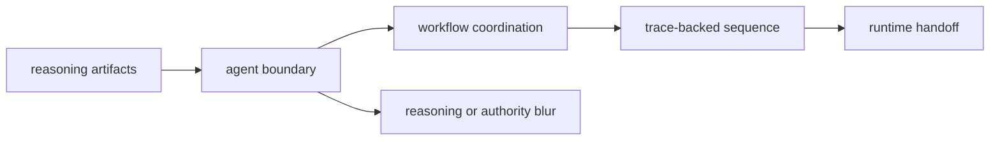

# Foundation

Open this section when you need to decide whether a behavior belongs to orchestration itself rather than to reasoning semantics below or runtime authority above. These pages should make `bijux-canon-agent` defensible as a coordination layer instead of a vague place where cross-package work happens.

## Boundary Model

The foundation story for agent has to prove that orchestration is a real owned
surface. Inputs arrive as reasoning artifacts, coordination happens here, a
trace leaves for runtime, and neither reasoning semantics nor final authority
gets silently absorbed into the middle.

## Read These First

- open [Ownership Boundary](https://bijux.io/bijux-canon/05-bijux-canon-agent/foundation/ownership-boundary/) first when a feature could belong in reasoning logic or runtime governance instead
- open [Package Overview](https://bijux.io/bijux-canon/05-bijux-canon-agent/foundation/package-overview/) when you need the shortest stable description of the package role
- open [Lifecycle Overview](https://bijux.io/bijux-canon/05-bijux-canon-agent/foundation/lifecycle-overview/) when the question is how role-based work becomes a traceable workflow

## The Mistake This Section Prevents

The most common mistake here is calling any multi-step behavior an agent concern even when the real ownership sits in reasoning policy or runtime acceptance.

## First Proof Check

- `packages/bijux-canon-agent/src/bijux_canon_agent` for the orchestration boundary in code
- `packages/bijux-canon-agent/tests` for proof that workflow coordination remains deterministic and inspectable
- `packages/bijux-canon-agent/apis` for tracked agent-facing contracts

## Pages In This Section

- [Package Overview](https://bijux.io/bijux-canon/05-bijux-canon-agent/foundation/package-overview/)
- [Scope and Non-Goals](https://bijux.io/bijux-canon/05-bijux-canon-agent/foundation/scope-and-non-goals/)
- [Ownership Boundary](https://bijux.io/bijux-canon/05-bijux-canon-agent/foundation/ownership-boundary/)
- [Repository Fit](https://bijux.io/bijux-canon/05-bijux-canon-agent/foundation/repository-fit/)
- [Capability Map](https://bijux.io/bijux-canon/05-bijux-canon-agent/foundation/capability-map/)
- [Domain Language](https://bijux.io/bijux-canon/05-bijux-canon-agent/foundation/domain-language/)
- [Lifecycle Overview](https://bijux.io/bijux-canon/05-bijux-canon-agent/foundation/lifecycle-overview/)
- [Dependencies and Adjacencies](https://bijux.io/bijux-canon/05-bijux-canon-agent/foundation/dependencies-and-adjacencies/)
- [Change Principles](https://bijux.io/bijux-canon/05-bijux-canon-agent/foundation/change-principles/)

## Leave This Section When

- leave this section for [Architecture](https://bijux.io/bijux-canon/05-bijux-canon-agent/architecture/) when you need the module or control-flow map
- leave this section for [Interfaces](https://bijux.io/bijux-canon/05-bijux-canon-agent/interfaces/) when the live question is a caller-facing contract
- leave this section for [Quality](https://bijux.io/bijux-canon/05-bijux-canon-agent/quality/) when the boundary is clear and the real issue is proof, invariants, or review gates

## Design Pressure

If “agent” becomes a label for any cross-package behavior, the package loses
all discipline. This section has to keep coordination, traceability, and
handoff authority visibly separate.
