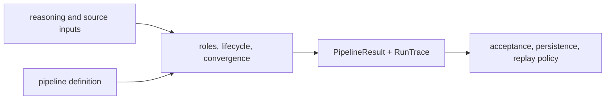

# Foundation

`bijux-canon-agent` owns traceable role orchestration. It defines which roles
may act, orders their lifecycle, merges work, evaluates convergence, records
veto and failure, and returns a typed pipeline result with an ordered trace.

## Authority boundary

```mermaid
flowchart LR
    evidence["reasoning and source inputs"]
    definition["pipeline definition"]
    agent["roles, lifecycle, convergence"]
    trace["PipelineResult + RunTrace"]
    runtime["acceptance, persistence, replay policy"]

    evidence --> agent
    definition --> agent --> trace --> runtime
```

Agent does not decide whether source evidence is epistemically sufficient; it
preserves the relevant role inputs and outputs. It also does not confer final
workflow authority: runtime may accept or reject the pipeline result, but it
must not reconstruct missing orchestration history.

## Owned decisions

| Decision | Owning contract | Evidence retained |
| --- | --- | --- |
| Which roles participate? | pipeline definition and validated configuration | definition identity, role list, configuration fingerprint |
| Which role acts next? | lifecycle controller and execution plan | ordered transition and causal position |
| Did an invocation succeed? | agent result or typed error | role, provider/model, usage, output, status, error |
| Did merged work pass? | goal-aware final validation | issues, warnings, action plan, terminal state |
| Did work converge? | convergence strategy and monitor | window, criterion, verdict history, decision, reason |
| Why did execution stop? | termination contract | completed, convergence, failure, abort, or resource exhaustion |
| What is published? | finalization contract | pipeline result, telemetry, trace reference, completeness state |

## Role model

The canonical workflow uses bounded roles for reading, summarization,
critique, validation, stage execution, planning, judgment, verification, and
orchestration. A pipeline selects the roles it needs; their existence does not
imply that every run invokes every role or provider.

A role's pass or veto is substantive output. Termination explains why the
controller stopped. Convergence describes a policy observation. These signals
are related but not interchangeable, and consumers must retain all three.

## Trust limits

- Convergence can stabilize on an incorrect artifact.
- A schema-valid role output can still be wrong.
- Bounded confidence is not automatically calibrated probability.
- Zero temperature is required for the package's replayable designation, but
  it cannot freeze a remote provider's model or serving environment.
- Reconstructing a trace is not re-executing historical provider behavior.
- A custom workflow graph does not inherit canonical lifecycle evidence unless
  it declares and validates equivalent transitions and trace fields.

## Read by question

| Question | Guide |
| --- | --- |
| What stable orchestration problem is solved? | [Package overview](package-overview.md) |
| What must remain in reason or runtime? | [Scope and non-goals](scope-and-non-goals.md) and [Ownership boundary](ownership-boundary.md) |
| Which roles and controls exist? | [Capability map](capability-map.md) |
| How does a run progress and terminate? | [Lifecycle overview](lifecycle-overview.md) |
| What do veto, convergence, replay, and trace completeness mean? | [Domain language](domain-language.md) |
| How does orchestration fit the monorepo? | [Repository fit](repository-fit.md) and [Dependencies and adjacencies](dependencies-and-adjacencies.md) |
| Which changes preserve auditability? | [Change principles](change-principles.md) |
