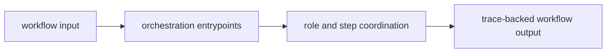

# Lifecycle Overview

The agent lifecycle starts when a workflow enters orchestration and ends when the coordinated result and its trace are clear enough for runtime or a caller to inspect.

## Lifecycle Flow

This page should frame agent as a workflow lifecycle with traceability built
in. The package earns its boundary when readers can see how coordination moves
from input to trace without confusing that work with final authority.

## Lifecycle Shape

- workflow input enters through package interfaces and orchestration entrypoints
- roles and steps coordinate under deterministic workflow rules
- trace-backed artifacts and outputs leave the package for callers or runtime governance

## Handoff Point

The lifecycle stops before final acceptance and persistence. Runtime owns that last authority step.

## Design Pressure

If the lifecycle starts resolving acceptance questions or redefining reasoning
artifacts, orchestration has reached past its role. The lifecycle has to stop
at traceable coordination output that runtime can judge separately.
