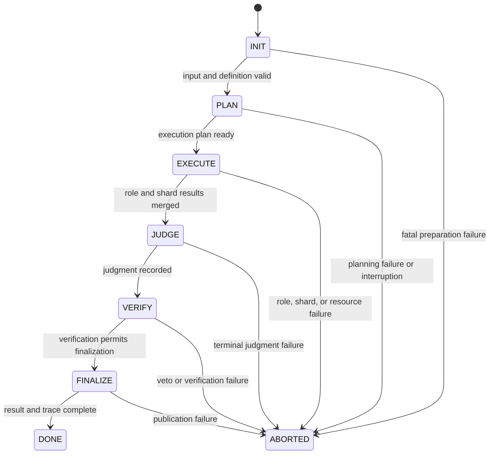

# Lifecycle Overview

The agent lifecycle turns a task goal and context into a typed result and an
ordered trace. Preparation, role execution, validation, convergence,
termination, and publication remain explicit phases.

```mermaid
stateDiagram-v2
    [*] --> INIT
    INIT --> PLAN: input and definition valid
    PLAN --> EXECUTE: execution plan ready
    EXECUTE --> JUDGE: role and shard results merged
    JUDGE --> VERIFY: judgment recorded
    VERIFY --> FINALIZE: verification permits finalization
    FINALIZE --> DONE: result and trace complete
    INIT --> ABORTED: fatal preparation failure
    PLAN --> ABORTED: planning failure or interruption
    EXECUTE --> ABORTED: role, shard, or resource failure
    JUDGE --> ABORTED: terminal judgment failure
    VERIFY --> ABORTED: veto or verification failure
    FINALIZE --> ABORTED: publication failure
```

## Preparation

1. Validate the task goal, input payload, context identity, pipeline
   definition, configuration, and model metadata.
2. Derive context and cache identity while excluding observational timestamp
   and nonce fields.
3. Determine required stages, initialize audit/revision/warning/telemetry
   records, and shard large inputs when configured.
4. Return an explicit cache hit only when the full context-derived key matches.

## Governed execution

The canonical pipeline follows `INIT → PLAN → EXECUTE → JUDGE → VERIFY →
FINALIZE → DONE`. Each active phase declares its permitted roles, entry and
exit conditions, and stop reasons. The controller validates transitions rather
than inferring order from completion timing.

Every shard runs its required stages and returns stage data, execution path,
audit trail, revisions, warnings, and terminal status. Results are merged
before goal-aware final validation. A failed shard produces a structured
failure path rather than disappearing behind a successful sibling.

## Convergence and termination

Convergence strategies evaluate retained score, verdict, confidence, or mixed
windows and can identify stability, confidence-only convergence, oscillation,
or maximum iterations. The snapshot, window hash, reason, and decision remain
part of the trace.

Termination separately records completion, convergence, failure, user abort,
or resource exhaustion. The role verdict and epistemic state remain separate
from both signals.

## Finalization and publication

Successful finalization closes telemetry, records counters, stores cacheable
success, persists the pipeline result, and derives the public final decision
back from the trace. CLI publication writes `result/final_result.json` and,
for a primary non-dry success, `trace/run_trace.json`.

The current files use fixed names and no run-level manifest, so each execution
should use a fresh output root. Replay validates and reconstructs the stored
trace, then compares its documented four-field summary projection. It does not
reinvoke providers or prove full byte equality.

## Terminal handoff

The lifecycle ends with traceable orchestration output or a structured failure
artifact. Runtime can then apply final flow policy. A missing trace, dry-run
veto, incomplete batch, or replay mismatch must remain visible at that handoff.
