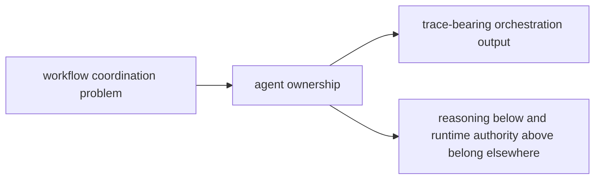

# Ownership Boundary

`bijux-canon-agent` owns orchestration above reasoning and below runtime authority. Use it when workflow behavior could be mistaken for either deeper reasoning semantics or final run governance.

## Boundary Map

This page should make agent read like a workflow boundary, not a place where
any hard late-stage behavior gets parked. The package matters when coordination
stays distinct from both claim policy and acceptance policy.

## Use This Boundary Test

- keep the work here when it changes role coordination, workflow order, trace output, or step orchestration
- move the work down to `bijux-canon-reason` when it changes claim meaning or verification policy
- move the work up to `bijux-canon-runtime` when it changes acceptance, persistence, or governed replay authority

## Borderline Example

A new role handoff rule belongs here. A new rule for whether a whole run should be rejected belongs in runtime.

## First Proof Check

- `packages/bijux-canon-agent/src` for the owned implementation boundary
- `packages/bijux-canon-agent/tests` for proof that the boundary survives change
- neighboring handbook roots in reason and runtime when the work still looks plausible elsewhere

## Design Pressure

The pressure on agent is to keep orchestration visible without absorbing either
reasoning semantics or final run judgment. If traces stop being enough to
explain the workflow, the boundary has started to drift.
