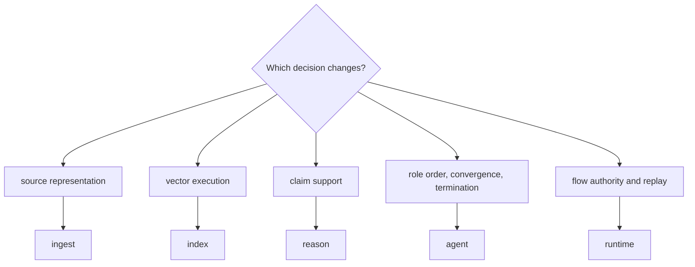

# Ownership Boundary

Agent authority is workflow-progression authority. It decides which bounded
role may act next and why execution stops, while preserving—not redefining—the
evidence and reasoning records consumed by those roles.

```mermaid
flowchart TD
    change{"Which decision changes?"}
    representation["source representation"]
    retrieval["vector execution"]
    meaning["claim support"]
    workflow["role order, convergence, termination"]
    acceptance["flow authority and replay"]

    change --> representation --> ingest["ingest"]
    change --> retrieval --> index["index"]
    change --> meaning --> reason["reason"]
    change --> workflow --> agent["agent"]
    change --> acceptance --> runtime["runtime"]
```

## Decision table

| Change | Owner | Reason |
| --- | --- | --- |
| parse another document format into a stable record | ingest | changes source admission |
| select an ANN backend under a budget | index | changes governed retrieval execution |
| reject a derived claim with no exact support | reason | changes reasoning verification |
| introduce critique after summarization | agent | changes role sequence and trace |
| stop after an oscillating verdict window | agent | changes convergence and termination |
| reject a complete pipeline because tenant entropy policy was exceeded | runtime | changes final flow authority |

## Reason-to-agent handoff

Reasoning artifacts can enter role inputs, but their claim kinds, statuses,
supports, and findings remain reason-owned facts. Agent may schedule critique
or verification, retain role output, and record a veto. It must not turn an
unsupported claim into a supported one through orchestration metadata.

## Agent-to-runtime handoff

Agent publishes a pipeline result and versioned trace containing definition,
configuration, role calls, transitions, convergence, termination, telemetry,
and final decision evidence. Runtime decides whether that governed output is
acceptable in the larger flow. Runtime must not infer missing role history or
upgrade an incomplete trace.

## Role and controller boundary

Individual role packages perform local work. The pipeline controller owns
lifecycle transitions and stop conditions. Roles cannot override the phase,
resume after kernel failure, or finalize the workflow implicitly. This
separation is defended by architecture invariants, not convention.

## Ownership test

Ask who must make the decision for the record to be valid. Claim verification
points to reason. Selecting and ordering roles, sharding, merging, convergence,
veto recording, and trace completion point to agent. Accepting the resulting
flow under tenant policy points to runtime.
