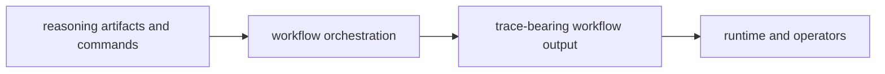

# Package Overview

`bijux-canon-agent` exists to coordinate role-based, multi-step behavior without hiding what happened. It owns deterministic orchestration, trace-bearing workflow progression, and agent-facing contracts that sit above reasoning and below runtime authority.

## Role Model

This page should show agent as the workflow layer, not as a place where any
hard late-stage problem gets parked. The package matters when it makes
coordination visible and replayable rather than merely convenient.

## Boundary Verdict

If the change decides how roles coordinate, which step runs next, or what trace a workflow must emit, it belongs here. If it decides what a claim means or whether a run counts, it belongs in another package.

## What This Package Makes Possible

- workflow behavior becomes explainable as orchestration rather than as accidental cross-package coupling
- trace output stays strong enough for readers to reconstruct what the agent did
- reasoning and runtime layers keep their own authority instead of being blurred into orchestration

## Tempting Mistakes

- calling any multi-step behavior an agent feature even when it is really reasoning logic
- letting runtime acceptance rules leak into orchestration because they are both late-stage concerns
- adding convenience workflow behavior that makes traces harder to defend

## First Proof Check

- `packages/bijux-canon-agent/src/bijux_canon_agent` for orchestration ownership in code
- `packages/bijux-canon-agent/tests` for determinism and traceability evidence
- `packages/bijux-canon-agent/apis` for tracked agent-facing surfaces

## Design Pressure

The pressure on agent is to keep orchestration distinct from both reasoning and
runtime authority. If traces stop being enough to explain why a workflow moved,
the package has absorbed too much hidden policy.
