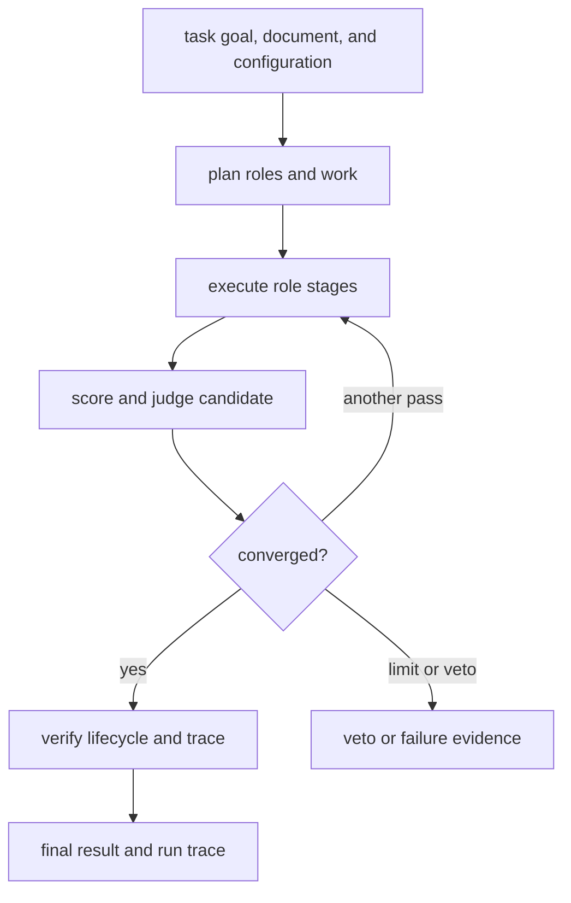

# Package Overview

`bijux-canon-agent` coordinates a document workflow through explicit roles,
lifecycle phases, judgments, convergence checks, and verification. It turns a
task and input into a terminal outcome whose trace explains why the pipeline
continued, stopped, passed, or vetoed.

The package is not a generic place for late-stage policy. Reasoning determines
what evidence supports; runtime determines whether governed execution is
acceptable. Agent owns the coordination between those boundaries.

## Orchestration Lifecycle


```mermaid
flowchart TD
    input["task goal, document, and configuration"]
    plan["plan roles and work"]
    execute["execute role stages"]
    judge["score and judge candidate"]
    converge{"converged?"}
    verify["verify lifecycle and trace"]
    finalize["final result and run trace"]
    abort["veto or failure evidence"]

    input --> plan --> execute --> judge --> converge
    converge -- another pass --> execute
    converge -- yes --> verify --> finalize
    converge -- limit or veto --> abort
```

The trace records permitted lifecycle transitions, role outputs and failures,
judgments, convergence metadata, termination reason, model identity, and
replay-critical hashes. A final result is derived from that trace rather than
maintained as an unrelated summary.

## What the Package Owns

| Surface | Responsibility |
| --- | --- |
| contracts | immutable agent inputs, task and context identity, execution modes |
| pipeline | standard phases, permitted transitions, retries, limits, and role coordination |
| judgment | verdict, score, confidence, and epistemic status |
| convergence | stability rules, iteration ceiling, convergence hash, and stop reason |
| trace validation | ordering, completeness, replay fields, model metadata, and terminal evidence |
| interfaces | document CLI and deterministic offline v1 HTTP application |

Provider adapters and document readers sit behind the pipeline boundary. Their
availability does not change the lifecycle evidence required from a completed
run.

## Two Operating Surfaces

The CLI runs configured document workflows and writes durable result and trace
files:

```bash
bijux-canon-agent run report.txt \
  --config agent.yml \
  --out artifacts/bijux-canon-agent
```

The v1 HTTP API is deliberately narrower. It runs a fixed offline
`simple`/`extractive` pipeline; request clients do not select arbitrary
providers, roles, strategies, or models through that boundary.

```bash
uvicorn bijux_canon_agent.api.v1.app:create_app \
  --factory --host 127.0.0.1 --port 8000
```

The distinction matters: API health and deterministic offline execution do not
prove that a provider-backed CLI configuration is valid.

## Result Contract

A successful non-dry CLI run writes:

- `result/final_result.json`, containing verdict, confidence, epistemic and
  termination state, convergence fields, runtime version, and trace path;
- `trace/run_trace.json`, containing the ordered evidence used to reconstruct
  the outcome.

Replay upgrades and validates the stored trace, reconstructs the result, and
compares it with the adjacent final result when one exists. Matching only the
verdict is insufficient; confidence, epistemic status, stop reason, schema,
runtime, and replay classifications also matter.

## Current CLI Credential Boundary

The CLI validates four provider variables before parsing any arguments:
`OPENAI_API_KEY`, `ANTHROPIC_API_KEY`, `HUGGINGFACE_API_KEY`, and
`DEEPSEEK_API_KEY`. This currently affects help, version, dry-run, and replay as
well as live execution. It is a bootstrap constraint, not evidence that every
workflow contacts every provider. The HTTP v1 path does not use this CLI
bootstrap.

## Ownership Boundary

Agent owns workflow progression and traceable coordination. It does not own
retrieval algorithms, claim semantics, or runtime-wide policy acceptance and
storage. Configuration that hides those decisions inside role prompts weakens
the package boundary even if the pipeline still completes.

The `bijux-agent` compatibility distribution preserves its established import
and command surface. New integrations should use `bijux-canon-agent`; see
[compatibility commitments](../interfaces/compatibility-commitments.md).

Continue with [installation and setup](../operations/installation-and-setup.md)
or [common workflows](../operations/common-workflows.md).
