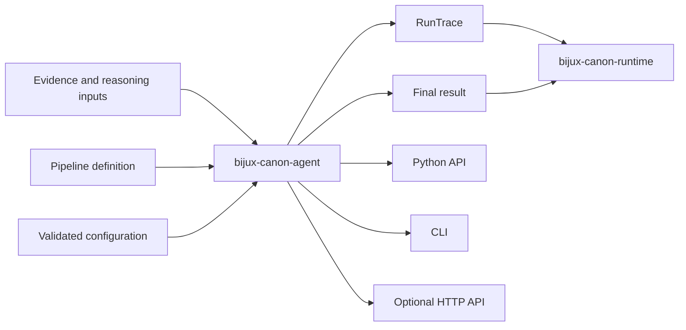

# Repository Fit

`bijux-canon-agent` is the independently installable orchestration layer in the
Canon family. It owns role execution, lifecycle authority, convergence,
provider invocation, typed terminal outcomes, and the trace that explains their
order. Keeping this boundary explicit prevents orchestration policy from hiding
inside reasoning or whole-run runtime control.

## Package boundary



The package may invoke reasoning and document-processing capabilities, but it
does not redefine their evidence contracts. It returns a pipeline result; the
runtime decides whether that result is admissible in a complete Canon run.

## Why the boundary is independently useful

Applications often need controlled multi-role execution without adopting the
runtime's persistence and cross-package policy. The agent package provides that
surface while keeping the result reviewable: validated configuration, explicit
transitions, typed role output, provider metadata, convergence evidence, stop
classification, and a reconstructable terminal result.

The package is not a general collection of autonomous helpers. A component
belongs here when it participates in governed orchestration and can be
represented in the lifecycle and trace contracts.

## Public surfaces

| Surface | Role | Contract |
| --- | --- | --- |
| Python package | compose roles, providers, lifecycle, and pipeline execution | typed configuration, results, errors, and traces |
| `bijux-canon-agent` CLI | execute a goal over one file or an immediate directory | exit behavior plus `final_result.json` and, when produced, `run_trace.json` |
| optional FastAPI application | expose the governed run operation to network clients | versioned route and the same pipeline result semantics |
| run trace | transfer orchestration history to reviewers and runtime | header, ordered entries, fingerprints, replay classification, and termination data |
| plugin/provider interfaces | add bounded execution implementations | adapters must preserve configuration, failure, usage, and secret-handling rules |

Interface parity means that the same substantive decision, confidence,
epistemic verdict, stop reason, and trace identity survive transport. It does
not require CLI and HTTP to encode operational errors identically.

## Repository placement

```text
packages/bijux-canon-agent/
├── src/bijux_canon_agent/   # lifecycle, roles, providers, pipeline, trace, interfaces
├── config/                  # shipped configuration examples and defaults
├── examples/                # executable and golden usage material
├── tests/                   # unit, invariant, contract, integration, and end-to-end evidence
├── README.md                # package entry point
└── pyproject.toml           # distribution, dependencies, extras, and CLI metadata
```

The package may use provider SDKs and optional FastAPI support, but its domain
contracts must remain usable without a network provider. Agent must not require
runtime to define its lifecycle or reason to define orchestration semantics.
Dependency direction flows from runtime into agent, not from agent back into
runtime authority.

## Boundary failure conditions

The repository fit has degraded if:

- roles become arbitrary functions with no typed handoff or trace entry;
- provider adapters can mutate lifecycle or terminal decisions;
- convergence and correctness are represented as the same condition;
- a final result cannot be reconciled with its run trace;
- HTTP and CLI paths apply different orchestration policy;
- runtime admission or reasoning truth claims are decided inside agent; or
- the package becomes the default home for unrelated workflow utilities.

The boundary is justified by inspectable coordination. If role authority,
lifecycle control, and causal trace no longer form one coherent contract, the
package should be reshaped by ownership rather than preserved as a historical
bucket.
