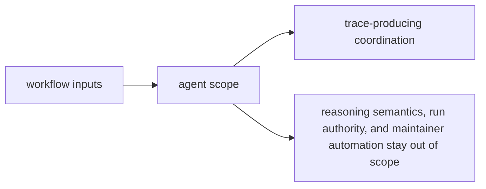

# Scope and Non-Goals

The scope of `bijux-canon-agent` is coordination that stays inspectable. It is not a general layer for all late-stage behavior in the system.

## Scope Map

This page should make orchestration feel constrained on purpose. Agent owns how
work is coordinated and exposed, but it should stop before redefining the lower
package meaning or the final runtime verdict.

## In Scope

- deterministic workflow progression across agent roles and steps
- trace-producing orchestration surfaces that explain what happened
- agent-facing contracts that callers and neighboring packages can inspect

## Non-Goals

- retrieval or reasoning semantics inside lower packages
- final authority over persistence, replay acceptance, or governed runs
- repository-wide maintainer automation and release mechanics

## Scope Check

If the change makes workflows harder to reconstruct from traces, the package is getting more magical instead of more useful.

## Design Pressure

If agent becomes a catch-all for anything late in the chain, traces stop being
enough to reconstruct what happened. The non-goals preserve orchestration as a
reviewable layer instead of a vague convenience layer.
