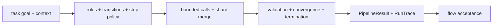

# Scope and Non-Goals

`bijux-canon-agent` owns governed coordination among bounded roles. It defines
workflow shape, transition authority, shard handling, convergence, termination,
result assembly, and trace evidence while keeping model providers and final
run acceptance outside its authority.

```mermaid
flowchart LR
    input["task goal + context"]
    definition["roles + transitions + stop policy"]
    execution["bounded calls + shard merge"]
    decision["validation + convergence + termination"]
    trace["PipelineResult + RunTrace"]
    runtime["flow acceptance"]

    input --> definition --> execution --> decision --> trace --> runtime
```

## In scope

- strict agent input, output, error, call, execution-plan, and runtime
  contracts;
- canonical pipeline definitions, role registries, lifecycle phases,
  transitions, stop conditions, and interruption handling;
- bounded file-reader, summarizer, critique, validator, stage-runner, planner,
  judge, and verifier roles;
- input preparation, context identity, cache keys, sharding, stage execution,
  result merge, final validation, revisions, warnings, and action plans;
- convergence strategies, snapshots, oscillation detection, decision windows,
  termination classification, and epistemic disposition;
- versioned traces, replayability metadata, ordering/completeness validation,
  result reconstruction, structured logging, counters, and telemetry;
- Python composition, CLI file/batch execution and replay, and the fixed
  offline HTTP v1 pipeline.

## Non-goals

| Not owned here | Owning boundary |
| --- | --- |
| Source normalization and chunk identity | `bijux-canon-ingest` |
| Vector backend selection and retrieval replay | `bijux-canon-index` |
| Claim support, evidence meaning, and reasoning verification | `bijux-canon-reason` |
| Final tenant authority, persistent governed-flow acceptance, and flow replay | `bijux-canon-runtime` |
| Guaranteeing model correctness, calibration, or provider determinism | model/provider evaluation and contract |
| Process isolation, distributed scheduling, secrets, network, or tenant policy | hosting system |
| Repository release and maintenance automation | maintenance tooling and handbook |

## Distinct outcome dimensions

Role verdict, convergence, termination, and execution success answer different
questions. A veto can occur in a technically successful role call. Convergence
can stop on stable but incorrect output. Resource exhaustion can terminate
without convergence. A valid trace preserves these distinctions rather than
compressing them into one success flag.

## Provider boundary

Provider adapters supply model behavior under recorded metadata. Zero
temperature is required for the package's replayable designation, but it
cannot freeze provider weights, infrastructure, or hidden policies. Live tests
demonstrate connectivity and metadata capture, not historical reproducibility
or answer correctness.

## Scope test

A change belongs here when it changes who acts, in which valid order, under
which stop and convergence rules, or what trace is required to reconstruct the
workflow. If it changes the meaning of a claim or the final authority over the
whole run, it belongs below or above agent.

See the [capability map](capability-map.md) and
[known limitations](../quality/known-limitations.md) for the implemented and
external boundaries.
