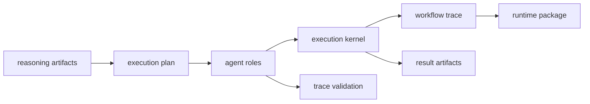

# Agent Handbook

`bijux-canon-agent` owns deterministic agent orchestration, workflow coordination, and trace-producing execution surfaces. It turns reasoning-capable steps into inspectable multi-step behavior without pretending that orchestration itself is runtime authority.

The main failure this handbook prevents is letting orchestration blur into either reasoning semantics below or runtime governance above. When those lines drift, readers can no longer tell whether a surprising behavior came from a decision, a workflow, or a run policy.

## What The Reader Should See First

Agent is the workflow coordination layer. It decides how role-specific steps
are ordered, how intermediate outputs are checked, and which trace proves what
happened. It should make multi-step behavior visible without becoming the owner
of retrieval truth, reasoning meaning, or final runtime acceptance.

Agent should make multi-step work easier to inspect, not harder. The handbook
is doing its job when a reader can tell how roles are sequenced, what trace is
supposed to survive the run, and which part of the behavior belongs to
orchestration rather than to reasoning or runtime policy.

## What This Package Owns

- coordination of agent roles, steps, and deterministic workflow progression
- trace-producing orchestration surfaces that explain what the agent did and in what order
- agent-facing contracts that sit above reasoning and below runtime governance

## What This Package Does Not Own

- retrieval and reasoning semantics in the lower package family
- acceptance, persistence, and replay authority for governed runs
- repository-wide maintainer automation and release governance

## Boundary Test

If the change decides how roles coordinate, which step runs next, or what
trace a workflow must emit, it belongs here. If the change decides what a
claim means or whether a whole run counts, it belongs elsewhere.

## First Proof Check

- `packages/bijux-canon-agent/src/bijux_canon_agent` for the orchestration implementation boundary
- `packages/bijux-canon-agent/src/bijux_canon_agent/pipeline` for workflow planning, execution, convergence, and finalization
- `packages/bijux-canon-agent/src/bijux_canon_agent/traces` for trace serialization and replayability
- `packages/bijux-canon-agent/tests` for proof that coordination remains deterministic and inspectable
- `apis/bijux-canon-agent/v1/schema.yaml` for the tracked caller-facing schema

## Start Here

- open [Foundation](https://bijux.io/bijux-canon/05-bijux-canon-agent/foundation/) when the question is why this package exists or where its ownership stops
- open [Architecture](https://bijux.io/bijux-canon/05-bijux-canon-agent/architecture/) when you need module boundaries, dependency flow, or execution shape
- open [Interfaces](https://bijux.io/bijux-canon/05-bijux-canon-agent/interfaces/) when the question is about commands, APIs, schemas, imports, or artifacts that callers may treat as stable
- open [Operations](https://bijux.io/bijux-canon/05-bijux-canon-agent/operations/) when you need local workflow, diagnostics, release, or recovery guidance
- open [Quality](https://bijux.io/bijux-canon/05-bijux-canon-agent/quality/) when the question is whether the package has proved its promises strongly enough

## Pages In This Package

- [Foundation](https://bijux.io/bijux-canon/05-bijux-canon-agent/foundation/)
- [Architecture](https://bijux.io/bijux-canon/05-bijux-canon-agent/architecture/)
- [Interfaces](https://bijux.io/bijux-canon/05-bijux-canon-agent/interfaces/)
- [Operations](https://bijux.io/bijux-canon/05-bijux-canon-agent/operations/)
- [Quality](https://bijux.io/bijux-canon/05-bijux-canon-agent/quality/)

## Leave This Handbook When

- the question is now about reasoning semantics rather than workflow coordination
- the next step is a concrete interface, trace model, or orchestration test
- the issue is actually about runtime acceptance or repository-level automation
