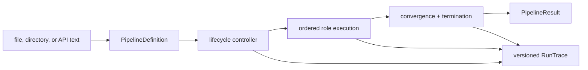

# Agent Handbook

`bijux-canon-agent` runs an auditable document workflow through explicit agent
roles, lifecycle transitions, convergence decisions, validation gates, and a
mandatory trace. The canonical roles include file reading, summarization,
critique, validation, stage execution, planning, judging, verification, and
orchestration; a pipeline chooses and orders them rather than treating every
role as an always-on swarm.

The orchestration result distinguishes success, partial or terminal failure,
termination reason, convergence decision, per-agent call records, telemetry,
and trace completeness. Runtime policy can later accept or reject that result,
but it does not reconstruct missing agent history.

```mermaid
flowchart LR
    input["file, directory, or API text"]
    definition["PipelineDefinition"]
    controller["lifecycle controller"]
    agents["ordered role execution"]
    convergence["convergence + termination"]
    result["PipelineResult"]
    trace["versioned RunTrace"]

    input --> definition --> controller --> agents --> convergence --> result
    controller --> trace
    agents --> trace
    convergence --> trace
```

## Observable Contract

| Surface | Accepted input | Durable output |
| --- | --- | --- |
| CLI `run` | file or directory, YAML configuration, optional dry-run and prior trace | structured result files, final artifact, logs, trace data |
| CLI `replay` | trace JSON path | reconstructed and validated trace information |
| HTTP `POST /v1/run` | bounded text, task goal, context identity, optional role/config overrides | result or structured error plus trace metadata |
| Python | pipeline definition, execution plan, typed role inputs | `PipelineResult`, failure artifact, telemetry, `RunTrace` |

The HTTP v1 contract intentionally supports the `extractive` strategy and
`simple` backend. Additional provider adapters in the source tree do not expand
that versioned API contract automatically.

## What This Package Owns

- coordination of agent roles, steps, and deterministic workflow progression
- trace-producing orchestration surfaces that explain what the agent did and in what order
- agent-facing contracts that sit above reasoning and below runtime governance

## What This Package Does Not Own

- retrieval and reasoning semantics in the lower package family
- acceptance, persistence, and replay authority for governed runs
- repository-wide maintainer automation and release governance

## Ownership Test

If the change decides how roles coordinate, which step runs next, or what
trace a workflow must emit, it belongs here. If the change decides what a
claim means or whether a whole run counts, it belongs elsewhere.

## Implementation Anchors

- `packages/bijux-canon-agent/src/bijux_canon_agent` for the orchestration implementation boundary
- `packages/bijux-canon-agent/src/bijux_canon_agent/pipeline` for workflow planning, execution, convergence, and finalization
- `packages/bijux-canon-agent/src/bijux_canon_agent/traces` for trace serialization and replayability
- `packages/bijux-canon-agent/tests` for proof that coordination remains deterministic and inspectable
- `apis/bijux-canon-agent/v1/schema.yaml` for the tracked caller-facing schema

## Start Here

- open [Foundation](https://bijux.io/bijux-canon/05-bijux-canon-agent/foundation/) when the question is why this package exists or where its ownership stops
- open [Architecture](https://bijux.io/bijux-canon/05-bijux-canon-agent/architecture/) when you need module boundaries, dependency flow, or execution shape
- open [Interfaces](https://bijux.io/bijux-canon/05-bijux-canon-agent/interfaces/) when the question is about commands, APIs, schemas, imports, or artifacts that callers may treat as stable
- open [Operations](https://bijux.io/bijux-canon/05-bijux-canon-agent/operations/) when you need local workflow, diagnostics, release, or recovery guidance
- open [Quality](https://bijux.io/bijux-canon/05-bijux-canon-agent/quality/) when the question is whether the package has proved its promises strongly enough

## Reference Areas

- [Foundation](https://bijux.io/bijux-canon/05-bijux-canon-agent/foundation/)
- [Architecture](https://bijux.io/bijux-canon/05-bijux-canon-agent/architecture/)
- [Interfaces](https://bijux.io/bijux-canon/05-bijux-canon-agent/interfaces/)
- [Operations](https://bijux.io/bijux-canon/05-bijux-canon-agent/operations/)
- [Quality](https://bijux.io/bijux-canon/05-bijux-canon-agent/quality/)

## Current Operational Constraint

The console entrypoint validates `OPENAI_API_KEY`, `ANTHROPIC_API_KEY`,
`HUGGINGFACE_API_KEY`, and `DEEPSEEK_API_KEY` before parsing the selected
command. Consequently, `--help`, dry-run, and replay currently require all four
credentials in the environment. This is an implementation constraint, not a
security recommendation or a claim that every workflow calls every provider.
