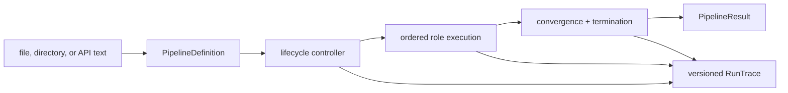

# Agent Handbook

`bijux-canon-agent` runs an auditable document workflow through explicit agent
roles, lifecycle transitions, convergence decisions, validation gates, and a
mandatory trace. The canonical roles include file reading, summarization,
critique, validation, stage execution, planning, judging, verification, and
orchestration; a pipeline chooses and orders them rather than treating every
role as an always-on swarm.

The orchestration result distinguishes success, partial or terminal failure,
termination reason, convergence decision, per-agent call records, telemetry,
and trace completeness. Runtime policy can later accept or reject that result,
but it does not reconstruct missing agent history.

```mermaid
flowchart LR
    input["file, directory, or API text"]
    definition["PipelineDefinition"]
    controller["lifecycle controller"]
    agents["ordered role execution"]
    convergence["convergence + termination"]
    result["PipelineResult"]
    trace["versioned RunTrace"]

    input --> definition --> controller --> agents --> convergence --> result
    controller --> trace
    agents --> trace
    convergence --> trace
```

## Observable Contract

| Surface | Accepted input | Durable output |
| --- | --- | --- |
| CLI `run` | file or directory, YAML configuration, optional dry-run and prior trace | structured result files, final artifact, logs, trace data |
| CLI `replay` | trace JSON path | reconstructed and validated trace information |
| HTTP `POST /v1/run` | bounded text, task goal, context identity, optional role/config overrides | result or structured error plus trace metadata |
| Python | pipeline definition, execution plan, typed role inputs | `PipelineResult`, failure artifact, telemetry, `RunTrace` |

The HTTP v1 contract intentionally supports the `extractive` strategy and
`simple` backend. Additional provider adapters in the source tree do not expand
that versioned API contract automatically.

## Follow One Workflow Decision

| Decision | Owning record | Evidence expected in the trace |
| --- | --- | --- |
| which roles may participate | `PipelineDefinition` and validated configuration | role identity, configuration fingerprint, and declared order |
| which role runs next | lifecycle controller and execution plan | transition, preceding outcome, and causal index |
| whether a provider call succeeded | per-agent call record | provider/model identity, input reference, status, usage, and error |
| whether work converged | convergence evaluator | criterion, prior state, candidate state, and decision |
| why execution stopped | pipeline finalization | terminal reason, completed and failed work, vetoes, and trace status |
| what the caller receives | `PipelineResult` or failure artifact | final artifact identity, partial results, telemetry, and trace reference |

The final artifact is not the audit trail. Review the ordered calls,
transitions, vetoes, and convergence decision before treating the artifact as
the result of the declared pipeline.

## Orchestration Trust Boundary

Agent owns role lifecycle and workflow progression. Reason owns the semantics
of evidence-backed claims supplied to a role; runtime owns final acceptance,
persistence, and replay policy above the pipeline. Agent preserves those
inputs and outputs in its trace rather than silently taking over either
decision.

Provider adapters are also outside the deterministic core. A trace can record
which provider and model were invoked, with which policy and observed result.
It cannot make a remote model deterministic or prove the provider honored an
unstated guarantee.

## Evidence And Limits

| Claim | Evidence to inspect | Limit |
| --- | --- | --- |
| the pipeline followed its definition | configuration fingerprint, ordered transitions, role records | does not prove role output quality |
| execution converged | declared criterion, evaluation records, terminal decision | convergence may still settle on an incorrect artifact |
| a veto affected the outcome | veto record, source role, target, finalization decision | absence from a summary is not absence from the trace |
| replay reconstructed history | versioned trace, schema validation, causal ordering | reconstruction does not re-execute provider behavior |
| telemetry is complete | call and lifecycle coverage plus trace-complete status | cannot include events the host or provider never exposed |

The [entrypoint examples](interfaces/entrypoints-and-examples.md) show the
Python, CLI, replay, and bounded HTTP contracts. The v1 HTTP surface supports
the documented offline strategy; source-level provider adapters do not expand
that schema automatically.

## Continue By Question

| Question | Next page |
| --- | --- |
| which responsibilities belong to an agent workflow? | [Foundation](foundation/index.md) |
| how do contracts, pipeline control, roles, adapters, and traces connect? | [Architecture](architecture/index.md) |
| which Python, CLI, HTTP, configuration, and artifact contracts are callable? | [Interfaces](interfaces/index.md) |
| how do I run, observe, diagnose, replay, or recover a pipeline? | [Operations](operations/index.md) |
| which invariants defend ordering, convergence, failure, and trace completeness? | [Quality](quality/index.md) |

## Current Operational Constraint

The console entrypoint validates `OPENAI_API_KEY`, `ANTHROPIC_API_KEY`,
`HUGGINGFACE_API_KEY`, and `DEEPSEEK_API_KEY` before parsing the selected
command. Consequently, `--help`, dry-run, and replay currently require all four
credentials in the environment. This is an implementation constraint, not a
security recommendation or a claim that every workflow calls every provider.
