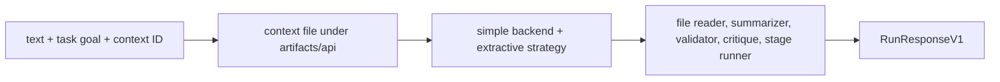

# HTTP API

The agent v1 API is a small dependency-light ASGI application for one fixed,
offline document pipeline. It exposes health and execution without importing
FastAPI at runtime. Start it as an ASGI factory:

```bash
uvicorn bijux_canon_agent.api.v1.app:create_app --factory \
  --host 127.0.0.1 --port 8000
```

## Operations

| Method and canonical path | Success | Behavior |
| --- | --- | --- |
| `GET /v1/health` | `200` | status and installed runtime version |
| `POST /v1/run` | `200` | execute the canonical offline pipeline and return its result |

The router also normalizes `/health` and `/run`, but `/v1/...` is the versioned
contract clients should use. Unknown paths return `404`; unsupported methods
return `405` with an `Allow` header.

## Fixed Execution Contract



Although `RunRequestV1` accepts a `config` object, the current handler does not
apply client overrides. Every request resolves to:

- backend: `simple`;
- strategy: `extractive`; and
- agents: `file_reader`, `summarizer`, `validator`, `critique`, and
  `stage_runner`.

The schema constrains named config fields to those values, permits additional
config fields, and then ignores the entire object during execution. Clients
must not infer configurability from payload acceptance.

## Run A Document

```bash
curl --fail-with-body http://127.0.0.1:8000/v1/run \
  --header 'content-type: application/json' \
  --data '{
    "text": "Signed run records are retained for seven years.",
    "task_goal": "Extract the retention period with its source sentence.",
    "context_id": "policy-17"
  }'
```

`text` is required and bounded to 200,000 characters. `task_goal` is required
and bounded to 4,000 characters. `context_id` defaults to `api-v1` and is
bounded to 128 characters. Unknown top-level request fields are rejected.

## Response And Failure Semantics

A successful response contains `success`, `context_id`, and the complete
pipeline `result`. The response model also includes optional `error` and
`trace_metadata`; the current handler does not populate `trace_metadata`.
Inspect trace material carried by the pipeline result and files rather than
assuming the optional metadata envelope is present.

| Status | Meaning |
| --- | --- |
| `400` | malformed JSON or request validation failure |
| `422` | pipeline execution failed or convergence was not reached |
| `500` | unexpected pipeline or adapter failure |

Errors carry stable `code`, `message`, and `http_status` fields. Pipeline and
convergence failures can also retain the partial result. The current internal
error path includes the caught exception text; deployments should treat error
responses and logs as potentially sensitive.

## Artifact And Concurrency Boundary

Each request writes its input beneath `artifacts/api/inputs`, using the SHA-256
digest of `context_id` as the filename, and writes logs and results beneath
`artifacts/api`. Reusing a context identity rewrites that input file. The
application does not provide a run lookup, artifact download, replay, or
retention API.

The ASGI layer reads the complete body into memory and supplies no independent
request-size, authentication, rate-limit, tenant-isolation, or concurrency
policy. Deploy it behind controls that enforce those concerns. Do not reuse a
context identity across untrusted callers.

## Contract Authority

The versioned schema is
[`apis/bijux-canon-agent/v1/schema.yaml`](https://github.com/bijux/bijux-canon/blob/main/apis/bijux-canon-agent/v1/schema.yaml),
with its pin and hash. The ASGI handlers and contract tests establish actual
availability. See [Data Contracts](data-contracts.md) for request and response
ownership and [Artifact Contracts](artifact-contracts.md) for trace-bearing
pipeline results.
