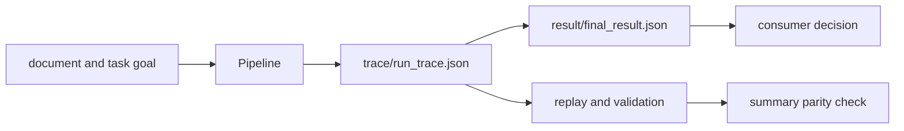

# Artifact Contracts

The agent CLI publishes a decision summary and, for an executed pipeline, the
trace that supports it. Consumers need both files: the summary is convenient
for gates, while the trace carries the lifecycle and replay evidence.



## Output Layout

For an output root selected with `--out`, the CLI writes:

```text
<output-root>/
├── result/
│   └── final_result.json
└── trace/
    └── run_trace.json       # successful non-dry execution only
```

`final_result.json` records verdict, confidence, epistemic status, stop and
termination reasons, convergence state, runtime version, and the relative trace
path. When a trace exists, it also records model metadata.

`run_trace.json` records schema-v2 header metadata and ordered entries. Its
header binds configuration, pipeline definition, runtime, convergence, and
model identity. Entries retain lifecycle phase, input and output, scores,
prompt and model hashes, replay metadata, epistemic state, failure or decision
artifacts, and the run fingerprint.

## Absence Has Meaning

A dry run or an invocation without a successful result writes an explicit veto
summary with zero confidence and no trace path. It does not write a synthetic
success trace. Consumers must inspect `verdict`, `confidence`, and `trace_path`;
file existence alone is not evidence of successful execution.

## Replay Relationship

Replay loads and upgrades the trace, validates its structure, reconstructs the
decision state, and compares it with the neighboring summary when available.
The comparison is semantic: verdict, confidence, epistemic state, and stop
reason matter. A missing summary is reported as a skipped comparison, not a
match.

Timestamps and the UUID-based run ID are observational. Configuration,
definition, prompts, model identity, decision state, convergence, and
fingerprints are evidence-bearing. Ignore expected clock variation only; never
use it to excuse a changed deterministic field.

## Publication Limits

Current CLI writes are individual JSON file writes. There is no run-level
manifest, transaction, or atomic directory publication. A process interruption
can therefore leave one file without the other or leave stale output from an
earlier run. Publish defensively:

1. write each run to a fresh output root;
2. require the summary's relative trace path to resolve below that root;
3. validate the trace schema and lifecycle before accepting the verdict;
4. run replay parity when the summary and trace are both present; and
5. move or copy the validated directory into long-term storage as one unit.

Artifacts may contain source text, prompts, model output, errors, and metadata.
Apply access controls and retention policy to the complete output root. See
[Data Contracts](data-contracts.md) for the record-level invariants.
