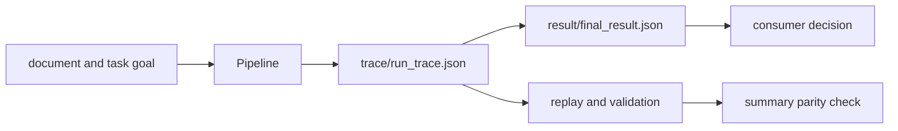
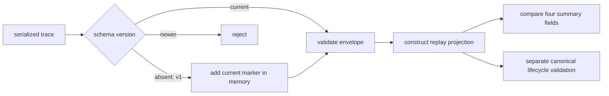

# Artifact Contracts

The agent CLI publishes a decision summary and, for an executed pipeline, the
trace that supports it. Consumers need both files: the summary is convenient
for gates, while the trace carries the lifecycle and replay evidence.



## Output Layout

For an output root selected with `--out`, the CLI writes:

```text
<output-root>/
├── result/
│   └── final_result.json
└── trace/
    └── run_trace.json       # successful non-dry execution only
```

`final_result.json` records verdict, confidence, epistemic status, stop and
termination reasons, convergence state, runtime version, and the relative trace
path. When a trace exists, it also records model metadata.

`run_trace.json` records schema-v2 header metadata and ordered entries. Its
header binds configuration, pipeline definition, runtime, convergence, and
model identity. Entries retain lifecycle phase, input and output, scores,
prompt and model hashes, replay metadata, epistemic state, failure or decision
artifacts, and the run fingerprint.

The installed research state additionally retains typed tool descriptor and
execution-record identities. Each execution record links the allow decision
and request digest to a result artifact or typed non-success status. Its safe
summary is an explicit descriptor allowlist of counts, status, and artifact
identities; raw queries, evidence text, model output, credentials, paths, and
exception messages are not tool-record fields.

## Absence Has Meaning

A dry run or an invocation without a successful result writes an explicit veto
summary with zero confidence and no trace path. It does not write a synthetic
success trace. Consumers must inspect `verdict`, `confidence`, and `trace_path`;
file existence alone is not evidence of successful execution.

## Replay Relationship

Replay loads and upgrades the trace, validates its structure, reconstructs the
decision state, and compares it with the neighboring summary when available.
The comparison is semantic: verdict, confidence, epistemic state, and stop
reason matter. A missing summary is reported as a skipped comparison, not a
match.

The built-in replay path performs schema-envelope validation, not the full
canonical lifecycle validation used while producing a pipeline trace. Its
loader reconstructs a reduced trace projection and does not retain every
serialized decision artifact, failure artifact, or run-fingerprint field in
the reconstructed entries. Consequently, successful loading and summary
parity are weaker claims than validating every lifecycle phase against the
original pipeline definition.

That parity check does not compare runtime version, termination reason,
convergence fields, model metadata, trace path, configuration hash, pipeline
definition hash, prompts, or run fingerprint. Those fields remain evidence to
inspect separately. “MATCH” means only that the four decision fields agree; it
does not mean the trace is byte-identical, fully lifecycle-valid, or reproduced
by another model invocation.

Timestamps and the UUID-based run ID are observational. Configuration,
definition, prompts, model identity, decision state, convergence, and
fingerprints are evidence-bearing. Ignore expected clock variation only; never
use it to excuse a changed deterministic field.

## Schema Compatibility Boundary

An absent `trace_schema_version` is interpreted as schema v1. The current v1
upgrade is deliberately shallow: it copies the payload, adds the current schema
marker, and checks only that a run ID and a non-empty entries list exist. It
does not transform each entry into a complete v2 record, prove lifecycle
ordering, or rewrite the source artifact. Explicit schema versions newer than
the runtime supports are rejected.



For imported v1 material, archive the original bytes, record the runtime used
for interpretation, and run canonical lifecycle validation after loading. Do
not publish the in-memory marker addition as evidence that a semantic migration
occurred.

## Publication Limits

Current CLI writes are individual JSON file writes. There is no run-level
manifest, transaction, or atomic directory publication. A process interruption
can therefore leave one file without the other or leave stale output from an
earlier run. Publish defensively:

1. write each run to a fresh output root;
2. require the summary's relative trace path to resolve below that root;
3. validate the trace schema and lifecycle before accepting the verdict;
4. run replay parity when the summary and trace are both present; and
5. move or copy the validated directory into long-term storage as one unit.

Artifacts may contain source text, prompts, model output, errors, and metadata.
Apply access controls and retention policy to the complete output root. See
[Data Contracts](data-contracts.md) for the record-level invariants.

## Acceptance Procedure

For a retained or imported output root:

1. require `final_result.json` and parse it as a decision summary;
2. if `trace_path` is absent, accept only the explicit veto semantics and do not
   infer why execution was unavailable from the summary alone;
3. if `trace_path` is present, require a relative path that resolves below the
   output root and points to the expected trace file;
4. upgrade and validate the trace schema, then run canonical lifecycle
   validation against the exact pipeline definition outside the built-in replay
   parity path;
5. reconstruct the decision projection and compare the four parity fields;
6. separately compare runtime, model, convergence, termination, configuration,
   definition, prompt, and fingerprint evidence; and
7. authenticate the directory externally when producer identity or tamper
   resistance matters.

The package does not publish a manifest or signature for this layout. Hashing
or signing the complete validated directory is therefore a responsibility of
the publishing workflow.
