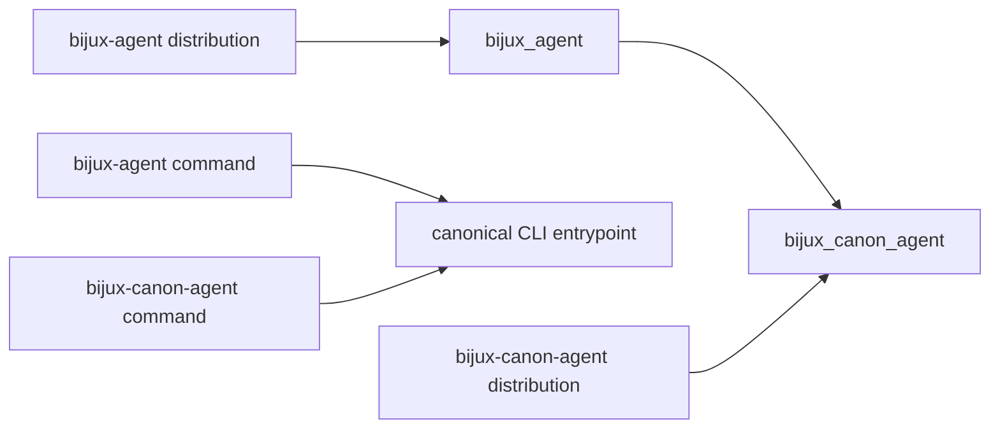

# Compatibility Commitments

The canonical distribution, import, and command are `bijux-canon-agent`,
`bijux_canon_agent`, and `bijux-canon-agent`.

The synchronized `bijux-agent` compatibility distribution preserves the
`bijux_agent` import and `bijux-agent` command. Both legacy surfaces delegate to
the canonical implementation at the same package version.

The alias forwards root exports, attribute discovery, and runtime submodules.
It does not maintain separate agent classes, pipeline semantics, traces, or API
schemas.

## Compatibility-Sensitive Surfaces

- contract models exposed from `bijux_canon_agent.contracts`;
- the pipeline facade and its final status and termination meanings;
- agent classes exported from `bijux_canon_agent.agents`;
- v1 HTTP routes, request schemas, and structured errors;
- CLI commands, option meaning, exit status, and output paths;
- trace schema versions, replay upgrades, ordering rules, and fingerprints; and
- decision, failure, epistemic, convergence, and stop-condition semantics.

The package root intentionally exposes only `API_VERSION`. Reachability through
an internal module does not create a compatibility promise.

## Artifact Compatibility

The alias name cannot make an invalid trace acceptable. Readers must still
validate the trace version, lifecycle coverage, replay fields, model metadata,
and relationship to `final_result.json`. If a future schema requires migration,
use the explicit trace upgrader and validate the upgraded payload before
comparison.

## Migration

Prefer canonical names in new code. Existing deployments can move in bounded
changes:

1. replace the installed distribution;
2. replace `bijux_agent` imports with `bijux_canon_agent`;
3. replace `bijux-agent` invocations with `bijux-canon-agent`; and
4. run the same input and configuration, then compare validated trace and final
   decision semantics.

See the [bijux-agent catalog entry](../../08-compat-packages/catalog/bijux-agent.md)
for package-level details.
