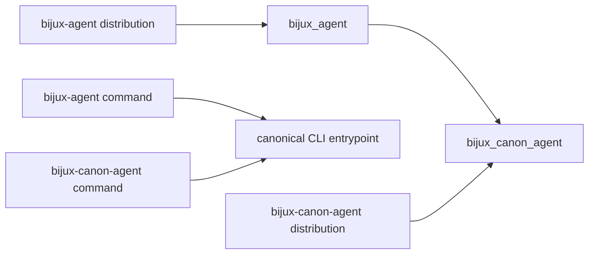

# Compatibility Commitments

The canonical distribution, import, and command are `bijux-canon-agent`,
`bijux_canon_agent`, and `bijux-canon-agent`.

The synchronized `bijux-agent` compatibility distribution preserves the
`bijux_agent` import and `bijux-agent` command. Both legacy surfaces delegate to
the canonical implementation at the same package version.

The alias forwards root exports, attribute discovery, and runtime submodules.
It does not maintain separate agent classes, pipeline semantics, traces, or API
schemas.

## Compatibility Evidence Chain

| Boundary | Required evidence | Insufficient evidence |
| --- | --- | --- |
| alias identity | same-release dependency and canonical module/class identity | matching names |
| command | canonical entrypoint, options, output, and exit status | both commands show help |
| contract | validated inputs, outputs, errors, retrieval envelope, and execution plan | payload parses as JSON |
| orchestration | role and call order, tool permission, failure propagation | final text exists |
| decision | convergence reason/hash, termination reason, epistemic status | pipeline stopped |
| trace | supported schema, lifecycle order, model metadata, run fingerprint, replay fields | trace file exists |
| final result | validated relationship between trace and `final_result.json` | both files mention the run ID |

## Compatibility-Sensitive Surfaces

- contract models exposed from `bijux_canon_agent.contracts`;
- the pipeline facade and its final status and termination meanings;
- agent classes exported from `bijux_canon_agent.agents`;
- v1 HTTP routes, request schemas, and structured errors;
- CLI commands, option meaning, exit status, and output paths;
- trace schema versions, replay upgrades, ordering rules, and fingerprints; and
- decision, failure, epistemic, convergence, and stop-condition semantics.

The package root intentionally exposes only `API_VERSION`. Reachability through
an internal module does not create a compatibility promise.

## Change Obligations

| Change | Required treatment |
| --- | --- |
| add or change a contract model | model/schema review and serialization coverage |
| change role order, permission, or failure propagation | orchestration evidence for accepted and refused cases |
| change convergence or termination semantics | explicit decision-contract change and trace coverage |
| change trace fields or ordering | schema version decision, upgrader path, and replay validation |
| change HTTP schema or structured errors | reviewed OpenAPI and route contract change |
| reorganize pipeline execution or CLI helpers | internal unless a documented facade or observable result changes |

## Artifact Compatibility

The alias name cannot make an invalid trace acceptable. Readers must still
validate the trace version, lifecycle coverage, replay fields, model metadata,
and relationship to `final_result.json`. If a future schema requires migration,
use the explicit trace upgrader and validate the upgraded payload before
comparison.

An upgrader establishes that a retained representation can be interpreted by
the current validator. It does not establish that the upgraded trace matches
the original final result, that provider behavior is unchanged, or that a run
would make the same convergence decision today.

## Migration

Prefer canonical names in new code. Existing deployments can move in bounded
changes:

1. replace the installed distribution;
2. replace `bijux_agent` imports with `bijux_canon_agent`;
3. inventory manifests, plugins, dependency injection, provider configuration,
   fixtures, dynamic imports, and serialized dotted paths;
4. replace `bijux-agent` invocations with `bijux-canon-agent`;
5. run fixed accepted and refused inputs under the same configuration; and
6. compare ordered interactions, structured results, termination, convergence,
   epistemic status, validated traces, run fingerprints, and final-result
   parity.

## Migration Acceptance

The bridge is removable for a consumer after canonical metadata, imports, and
commands are deployed; retained traces upgrade and validate where required;
representative success and refusal semantics remain accounted for; trace and
final-result relationships are verified; and no deployed environment
independently requests the `bijux-agent` distribution.

See the [bijux-agent catalog entry](../../08-compat-packages/catalog/bijux-agent.md)
for package-level details.
