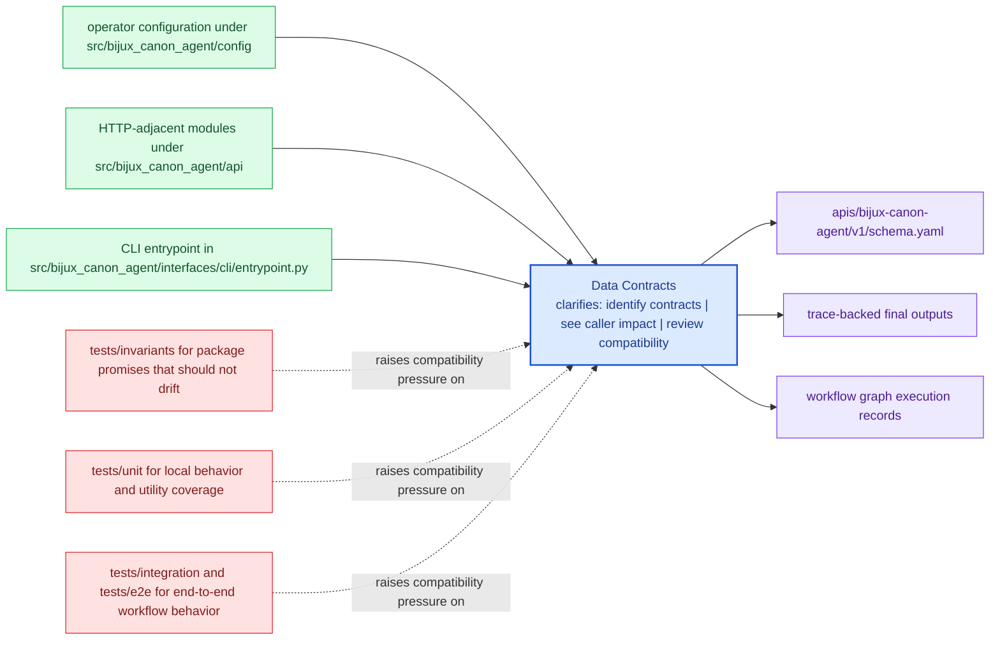

# Data Contracts

Data contracts in `bijux-canon-agent` include schemas, structured models, and any stable
payload shape that neighboring systems are expected to understand.

This page keeps data shape changes reviewable. If a record or payload matters to
another package, another process, or a replay path, it deserves to be described
as a contract rather than left implicit in implementation details.

Treat the interfaces pages for `bijux-canon-agent` as the bridge between implementation detail and caller expectation. They should show what the package is prepared to defend before a dependency forms.

## Visual Summary

## Contract Anchors

- apis/bijux-canon-agent/v1/schema.yaml

## Artifact Anchors

- trace-backed final outputs
- workflow graph execution records
- operator-visible result artifacts

## Concrete Anchors

- CLI entrypoint in src/bijux_canon_agent/interfaces/cli/entrypoint.py
- operator configuration under src/bijux_canon_agent/config
- HTTP-adjacent modules under src/bijux_canon_agent/api
- apis/bijux-canon-agent/v1/schema.yaml

## Use This Page When

- you need the public command, API, import, schema, or artifact surface
- you are checking whether a caller can safely rely on a given entrypoint or shape
- you want the contract-facing side of the package before building on it

## Decision Rule

Use `Data Contracts` to decide whether a caller-facing surface is explicit enough to depend on. If the surface cannot be tied back to concrete code, schemas, artifacts, examples, and tests, treat it as unstable until that evidence is visible.

## What This Page Answers

- which public or operator-facing surfaces `bijux-canon-agent` is really asking readers to trust
- which schemas, artifacts, imports, or commands behave like contracts
- what compatibility pressure a change to this surface would create

## Reviewer Lens

- compare commands, schemas, imports, and artifacts against the documented surface one by one
- check whether a seemingly local change actually needs compatibility review
- confirm that examples still point to real entrypoints and not to stale habits

## Honesty Boundary

This page can identify the intended public surfaces of `bijux-canon-agent`, but real compatibility depends on code, schemas, artifacts, examples, and tests staying aligned. If those disagree, the prose is wrong or incomplete.

## Next Checks

- move to operations when the caller-facing question becomes procedural or environmental
- move to quality when compatibility or evidence of protection becomes the real issue
- move back to architecture when a public-surface question reveals a deeper structural drift

## Purpose

This page explains which structured shapes deserve compatibility review.

## Stability

Keep it aligned with tracked schemas, stable models, and durable artifacts.
