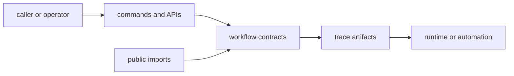

# Interfaces

Open this section when the question is contractual: which agent workflows, commands, artifacts, and imports callers or operators may treat as stable instead of incidental.

## Contract Model

The interface story for agent is not just about entrypoints. It is about which
workflow surfaces and trace artifacts the package is prepared to defend once
another tool or operator starts depending on them.

## Read These First

- open [Operator Workflows](https://bijux.io/bijux-canon/05-bijux-canon-agent/interfaces/operator-workflows/) first when the contract question is really about how a workflow is supposed to be run or observed
- open [CLI Surface](https://bijux.io/bijux-canon/05-bijux-canon-agent/interfaces/cli-surface/) when the issue begins with an agent command or entrypoint
- open [Compatibility Commitments](https://bijux.io/bijux-canon/05-bijux-canon-agent/interfaces/compatibility-commitments/) when a workflow surface change may break automation or callers

## Contract Risk

The main contract risk here is letting workflow behavior look stable to operators while its actual boundary stays undocumented.

## First Proof Check

- `src/bijux_canon_agent/interfaces` and `apis` for named caller-facing surfaces
- trace-bearing artifacts and examples for workflow expectations
- `tests` for determinism and compatibility evidence

## Pages In This Section

- [CLI Surface](https://bijux.io/bijux-canon/05-bijux-canon-agent/interfaces/cli-surface/)
- [API Surface](https://bijux.io/bijux-canon/05-bijux-canon-agent/interfaces/api-surface/)
- [Configuration Surface](https://bijux.io/bijux-canon/05-bijux-canon-agent/interfaces/configuration-surface/)
- [Data Contracts](https://bijux.io/bijux-canon/05-bijux-canon-agent/interfaces/data-contracts/)
- [Artifact Contracts](https://bijux.io/bijux-canon/05-bijux-canon-agent/interfaces/artifact-contracts/)
- [Entrypoints and Examples](https://bijux.io/bijux-canon/05-bijux-canon-agent/interfaces/entrypoints-and-examples/)
- [Operator Workflows](https://bijux.io/bijux-canon/05-bijux-canon-agent/interfaces/operator-workflows/)
- [Public Imports](https://bijux.io/bijux-canon/05-bijux-canon-agent/interfaces/public-imports/)
- [Compatibility Commitments](https://bijux.io/bijux-canon/05-bijux-canon-agent/interfaces/compatibility-commitments/)

## Leave This Section When

- leave for [Foundation](https://bijux.io/bijux-canon/05-bijux-canon-agent/foundation/) when the contract dispute is really a package-boundary dispute
- leave for [Architecture](https://bijux.io/bijux-canon/05-bijux-canon-agent/architecture/) when a surface question reveals structural drift underneath it
- leave for [Operations](https://bijux.io/bijux-canon/05-bijux-canon-agent/operations/) or [Quality](https://bijux.io/bijux-canon/05-bijux-canon-agent/quality/) when the boundary is clear and the question becomes execution or proof

## Design Pressure

If a caller can only learn what is stable after reading workflow internals, the
contract page is too weak. This section has to name which surfaces and trace
artifacts are intentionally reusable.
