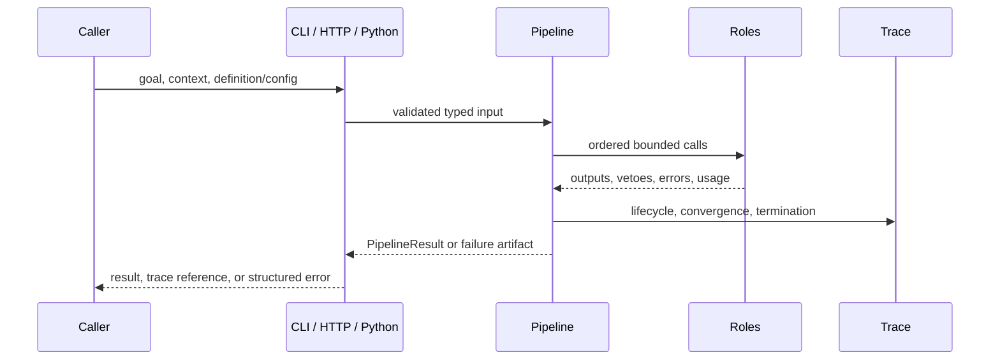

# Interfaces

Agent interfaces expose orchestration at three levels: role calls, complete
pipeline executions, and persisted traces. Consumers must not collapse those
contracts into a single untyped “agent response.”

## Surface map

| Surface | Supported use | Important boundary |
| --- | --- | --- |
| Python | custom definitions, role calls, governed pipeline execution, trace handling | caller composes explicit typed contracts |
| CLI `run` | one file or immediate files in one directory | writes a result summary and, after primary success, one trace |
| CLI `replay` | reconstruct and compare a stored trace | hidden but callable; comparison covers four summary fields |
| HTTP `POST /v1/run` | bounded text through the canonical offline pipeline | fixed `simple` backend and `extractive` strategy |
| YAML configuration | task goal, model metadata, logging, and pipeline options | current CLI default is working-directory-relative; use an explicit path |
| output directory | result and trace publication | fixed filenames, direct writes, no manifest or run-level transaction |

## Pipeline contract path

```mermaid
sequenceDiagram
    participant Caller
    participant Edge as CLI / HTTP / Python
    participant Pipeline
    participant Roles
    participant Trace
    Caller->>Edge: goal, context, definition/config
    Edge->>Pipeline: validated typed input
    Pipeline->>Roles: ordered bounded calls
    Roles-->>Pipeline: outputs, vetoes, errors, usage
    Pipeline->>Trace: lifecycle, convergence, termination
    Pipeline-->>Edge: PipelineResult or failure artifact
    Edge-->>Caller: result, trace reference, or structured error
```

## Honest surface distinctions

- The HTTP request accepts a `config` object, but v1 ignores its contents and
  executes the fixed offline pipeline. Accepted fields are not evidence of
  configurability.
- Provider adapters in the source tree do not expand the HTTP v1 contract.
- The CLI `--replay` option on `run` checks and logs a path; it does not alter or
  validate the new execution. The separate replay command performs stored-
  trace reconstruction.
- Individual file failures do not necessarily produce a non-zero CLI exit.
  Automation must inspect the written summary, trace path, and batch records.
- Dry-run veto and zero confidence are simulation markers, not a judgment about
  the input document.
- A replay `MATCH` covers verdict, confidence, epistemic state, and stop reason
  only; it is not byte equality or full lifecycle equivalence.

## Contract index

| Need | Guide |
| --- | --- |
| Run files or reconstruct a trace | [CLI surface](cli-surface.md) |
| Integrate the fixed offline HTTP pipeline | [API surface](api-surface.md) |
| Resolve YAML, environment, model, and log settings | [Configuration surface](configuration-surface.md) |
| Construct role, pipeline, convergence, result, and trace records | [Data contracts](data-contracts.md) |
| Publish or accept result and trace files | [Artifact contracts](artifact-contracts.md) |
| Compose package-owned modules | [Public imports](public-imports.md) |
| Follow operator journeys | [Operator workflows](operator-workflows.md) |
| Evaluate a caller-visible change | [Compatibility commitments](compatibility-commitments.md) |
| Start from executable calls | [Entrypoints and examples](entrypoints-and-examples.md) |
