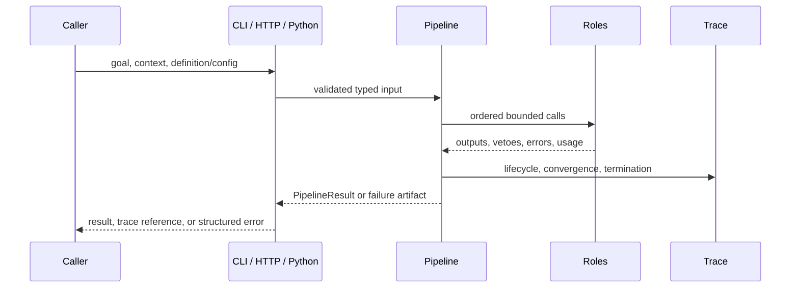

# Interfaces

Agent interfaces expose orchestration at three levels: role calls, complete
pipeline executions, and persisted traces. Consumers must not collapse those
contracts into a single untyped “agent response.”

## Surface map

| Surface | Supported use | Important boundary |
| --- | --- | --- |
| Python | custom definitions, role calls, governed pipeline execution, trace handling | caller composes explicit typed contracts |
| CLI `run` | one file or immediate files in one directory | writes a result summary and, after primary success, one trace |
| CLI `replay` | reconstruct and compare a stored trace | hidden but callable; comparison covers four summary fields |
| HTTP `POST /v1/run` | bounded text through the canonical offline pipeline | fixed `simple` backend and `extractive` strategy |
| YAML configuration | task goal, model metadata, logging, and pipeline options | current CLI default is working-directory-relative; use an explicit path |
| output directory | result and trace publication | fixed filenames, direct writes, no manifest or run-level transaction |

## Pipeline contract path

```mermaid
sequenceDiagram
    participant Caller
    participant Edge as CLI / HTTP / Python
    participant Pipeline
    participant Roles
    participant Trace
    Caller->>Edge: goal, context, definition/config
    Edge->>Pipeline: validated typed input
    Pipeline->>Roles: ordered bounded calls
    Roles-->>Pipeline: outputs, vetoes, errors, usage
    Pipeline->>Trace: lifecycle, convergence, termination
    Pipeline-->>Edge: PipelineResult or failure artifact
    Edge-->>Caller: result, trace reference, or structured error
```

## Honest surface distinctions

- The HTTP request accepts a `config` object, but v1 ignores its contents and
  executes the fixed offline pipeline. Accepted fields are not evidence of
  configurability.
- Provider adapters in the source tree do not expand the HTTP v1 contract.
- The CLI `--replay` option on `run` checks and logs a path; it does not alter or
  validate the new execution. The separate replay command performs stored-
  trace reconstruction.
- Individual file failures do not necessarily produce a non-zero CLI exit.
  Automation must inspect the written summary, trace path, and batch records.
- Dry-run veto and zero confidence are simulation markers, not a judgment about
  the input document.
- A replay `MATCH` covers verdict, confidence, epistemic state, and stop reason
  only; it is not byte equality or full lifecycle equivalence.

## Accept a published pipeline outcome

Treat the result, trace, and files as related records rather than one success
flag:

| Record | Confirm | Do not infer |
| --- | --- | --- |
| request and definition | goal, context identity, eligible roles, configuration fingerprint and execution mode | that every configured provider or role was invoked |
| call dispositions | every attempted role or shard has output, veto, typed error, or explicit non-execution | that one successful call makes the batch successful |
| `PipelineResult` | terminal status, stop reason, convergence result, partial failures, telemetry and artifact identity agree | that converged content is correct or complete |
| `RunTrace` | mandatory header, ordered transitions and calls, finalization, completeness and replay fields | that provider behavior can be reproduced from metadata |
| published files | summary, final artifact and trace refer to the same execution and are fully written | that directory presence is transactional publication |
| interface response | CLI exit/payload or HTTP status/body matches the underlying result | that accepted request fields changed the fixed HTTP pipeline |

The package does not currently publish a run manifest or transactionally bind
the output directory. A host that needs durable acceptance should hash the
closed files, record their shared execution identity, and publish them
atomically at its own storage boundary. Missing trace or partial batch evidence
must remain visible during that promotion.

## Select a surface by the promise you need

The interfaces do not expose one interchangeable agent operation. Choose the
narrowest surface whose evidence contract matches the caller's promise:

| Caller promise | Use | Additional responsibility |
| --- | --- | --- |
| invoke or compose typed roles and pipeline policies | Python modules | caller owns provider configuration, storage, and publication |
| process local files and retain result plus trace output | CLI `run` | inspect per-file records; process success alone does not prove batch success |
| reconstruct a stored outcome | CLI replay or trace readers | current CLI comparison covers only verdict, confidence, epistemic state and stop reason |
| serve the documented offline extraction workflow | HTTP v1 | treat `config` as non-operative and do not infer provider selection |
| publish a durable workflow record | host storage boundary around result and `RunTrace` | hash and atomically bind files because the package emits no run manifest |
| preserve an older command or import | `bijux-agent` compatibility package | pin the canonical version and test caller-visible parity |

For new service integrations, HTTP is intentionally narrower than the Python
pipeline system. For unattended batch automation, the CLI is intentionally
more informative than its exit status. For durable acceptance, neither
transport removes the need to bind the request, result, trace, and published
files to one execution identity.

## Contract index

| Need | Guide |
| --- | --- |
| Run files or reconstruct a trace | [CLI surface](cli-surface.md) |
| Integrate the fixed offline HTTP pipeline | [API surface](api-surface.md) |
| Resolve YAML, environment, model, and log settings | [Configuration surface](configuration-surface.md) |
| Construct role, pipeline, convergence, result, and trace records | [Data contracts](data-contracts.md) |
| Publish or accept result and trace files | [Artifact contracts](artifact-contracts.md) |
| Compose package-owned modules | [Public imports](public-imports.md) |
| Follow operator journeys | [Operator workflows](operator-workflows.md) |
| Evaluate a caller-visible change | [Compatibility commitments](compatibility-commitments.md) |
| Start from executable calls | [Entrypoints and examples](entrypoints-and-examples.md) |
