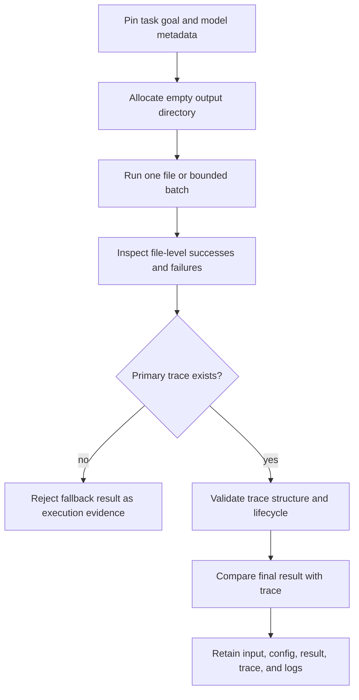

# Operator Workflows

Operate each Agent invocation as a separate evidence unit. The CLI's fixed
artifact names make output-directory isolation the first control, not an
optional housekeeping choice.



## Prepare a controlled invocation

1. Choose one testable `task_goal`.
2. Pin pipeline limits, retry behavior, quality threshold, and logging paths.
3. Set complete `model_metadata`; use temperature `0.0` when replayability is
   required.
4. provide required provider keys through the execution environment.
5. allocate a new output directory that no concurrent or earlier invocation
   uses.

```bash
RUN_ROOT="artifacts/bijux-canon-agent/retention-review"

bijux-canon-agent run policies/retention.md \
  --config agent.yml \
  --out "$RUN_ROOT"
```

The selected input file is recorded as a path and contributes to an input
hash with the task goal. Preserve the actual input bytes separately: the CLI
does not copy the source document into its output bundle.

## Accept a single-file result

Require both:

```text
result/final_result.json
trace/run_trace.json
```

Then evaluate the evidence in order:

1. confirm that the trace `run_id` is non-empty and its entry list is not
   empty;
2. require the supported `trace_schema_version` and a compatible
   `runtime_version`;
3. inspect `replay_status` and reject a replayability claim when it is
   `NON_REPLAYABLE`;
4. compare configuration, pipeline-definition, contract, prompt, model, and
   input hashes with the retained inputs;
5. validate phase ordering and allowed transitions with the package's trace
   validation APIs;
6. inspect role errors, failure artifacts, scores, decision artifacts, and
   verifier outcomes;
7. compare terminal decision, confidence, epistemic verdict, stop reason,
   termination reason, convergence data, and model metadata with
   `final_result.json`.

The replay CLI performs only part of this acceptance sequence. Loading a trace
checks schema compatibility and minimal shape, not all lifecycle semantics.

## Handle a directory batch

The directory resolver is non-recursive and does not pre-filter extensions.
Keep a manifest of intended inputs before running, then reconcile it with
successful and failed file records in the logs.

The final artifact represents only the first successful file. It is not a
batch summary, and failures in other files do not force a nonzero process exit.
For independent, auditable outputs, invoke the CLI once per file with a unique
output directory.

## Interpret stopping evidence

Read terminal fields together:

| Evidence | Question answered |
| --- | --- |
| decision | Did the terminal judgment pass or veto the candidate? |
| confidence | How strong was the normalized terminal score? |
| epistemic verdict | Was the knowledge state certain, uncertain, or contradictory? |
| stop reason | Which policy condition stopped orchestration? |
| termination reason | How did execution itself terminate? |
| convergence reason and iterations | Why and when did iterative work stabilize or stop? |
| replay status | Does the recorded model and metadata satisfy replayability rules? |

Never recast a budget limit, maximum-iteration stop, verification veto, fatal
failure, or epistemic failure as a successful low-confidence answer.

## Compare a stored summary

```bash
bijux-canon-agent replay "$RUN_ROOT/trace/run_trace.json"
```

The command locates the result file by moving from `trace/` to sibling
`result/`. It prints `MATCH` only when decision, confidence, epistemic verdict,
and stop reason agree. It prints `MISMATCH` with a heuristic category when one
of those values differs.

Because mismatch still exits successfully, capture and parse the emitted
status when using this command in automation. Perform separate comparisons for
all other terminal and identity fields. This command is not a provider replay
and does not prove that identical input bytes would reproduce the role outputs.

## Investigate a failure

Follow causality rather than editing terminal JSON:

1. credential and configuration loading;
2. input discovery and file-reader support;
3. lifecycle phase and transition;
4. role error and failure mode;
5. retry budget and timeout;
6. judgment and verifier decision;
7. convergence and stop condition;
8. trace/result serialization.

Preserve the failed output directory and logs. Run a corrected input or
configuration into a different directory so the failed evidence remains
reviewable.

## Retention set

Retain together:

- source document bytes and a separately computed digest;
- exact YAML configuration and task goal;
- package/runtime version and secret-free environment description;
- structured logs, including every file-level success and failure;
- `result/final_result.json` and `trace/run_trace.json`;
- any independent lifecycle validation or summary-comparison report.

The package does not currently write a bundle manifest or use atomic artifact
publication. If the result crosses a process or trust boundary, add a governed
external manifest and immutable storage policy around this retention set.
