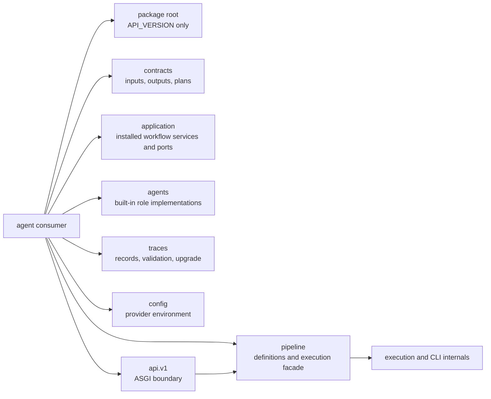

# Public Imports

The package root is intentionally small. It lazily exposes only the HTTP API
version:

```python
from bijux_canon_agent import API_VERSION
```

Import application capabilities from the facade that owns them.

## Facade Architecture



The small root prevents contracts, providers, orchestration, traces, and HTTP
dependencies from collapsing into one accidental API. Each named facade has a
separate responsibility and evidence burden.

## Supported Facades

| Need | Import surface |
| --- | --- |
| validated agent calls and outputs | `bijux_canon_agent.contracts` |
| installed research orchestration | `bijux_canon_agent.application` |
| pipeline construction | `bijux_canon_agent.pipeline` |
| built-in roles | `bijux_canon_agent.agents` |
| trace validation and replay models | `bijux_canon_agent.traces` |
| ASGI application | `bijux_canon_agent.api.v1` |
| runtime-safe configuration | `bijux_canon_agent.config` |

Import objects re-exported by these facades rather than reaching through them
to implementation files. The facade `__all__` lists are the supported
namespace inventories.

```python
from bijux_canon_agent.contracts import AgentInput
from bijux_canon_agent.enums import AgentType, ExecutionMode

request = AgentInput(
    task_goal="Summarize the retention rule without unsupported claims.",
    payload={"text": "Retain signed records for seven years."},
    context_id="retention-policy-17",
    agent_type=AgentType.PLANNER,
    execution_mode=ExecutionMode.SYNC,
)
```

Construction validates the contract but does not execute a role or contact a
model provider.

Installed composition imports `InstalledResearchService` and its typed request
and port records from `bijux_canon_agent.application`. The service owns search
selection, causal ordering, and convergence progression. An integrating
runtime implements the port; it does not construct Agent role events itself.

`AgentInput` belongs to the runtime contract model. HTTP schema models live at
the API boundary. Keep those representations distinct even when their fields
overlap; mapping makes defaults, validation failures, and version ownership
explicit.

## Pipeline, Trace, and API Imports

```python
from bijux_canon_agent.api.v1 import API_VERSION, create_app
from bijux_canon_agent.pipeline import AuditableDocPipeline, PipelineDefinition
from bijux_canon_agent.traces import RunTrace, validate_trace_payload
```

The pipeline facade is import-light and resolves its implementations lazily.
The trace facade includes v1 and v2 validators plus the explicit upgrader. The
API factory owns the deterministic offline HTTP boundary.

## What Each Import Establishes

| Import | Establishes | Does not establish |
| --- | --- | --- |
| contract model | typed input, output, error, retrieval, or plan structure | provider availability or successful role execution |
| pipeline definition | declared roles and orchestration structure | convergence, termination, or final acceptance |
| built-in agent class | a supported role implementation | permission to call tools or models |
| trace record | representable lifecycle evidence | valid ordering, supported schema, or parity with final result |
| trace validator/upgrader | supported schema conversion and structural validation | equivalence to the original execution |
| API factory | versioned ASGI application construction | live provider configuration or consumer authorization |

A successfully constructed pipeline is not a completed run. A completed run is
not necessarily converged, verified, or epistemically acceptable. Preserve
those distinctions in application code.

## Trace Consumption

Use `upgrade_trace` before `validate_trace_payload` when reading retained
payloads that may use an older supported schema. Reject unknown future schema
versions instead of coercing them. After structural validation, compare the
trace relationship to `final_result.json`, including run fingerprint,
termination reason, convergence metadata, epistemic status, lifecycle order,
and replay metadata.

Avoid imports from `pipeline.execution`, `interfaces.cli`, individual
orchestration helpers, or underscore-prefixed modules. Those modules implement
the facades and may be reorganized without becoming package-root API.

## Upgrade Evidence By Facade

| Used facade | Focused compatibility evidence |
| --- | --- |
| `contracts` | model construction, validation, enum meaning, and serialization |
| `pipeline` and `agents` | accepted/refused workflows, call order, termination, and convergence |
| `traces` | schema snapshots, upgrade, ordering, fingerprints, and final-result parity |
| `config` | provider discovery and missing/invalid-key behavior without exposing secrets |
| `api.v1` | OpenAPI pin, route contracts, structured errors, and CLI/HTTP parity where promised |

`bijux_agent` forwards the canonical namespace for legacy consumers. New code
should use `bijux_canon_agent`; see
[Compatibility Commitments](compatibility-commitments.md) for the migration
boundary.
