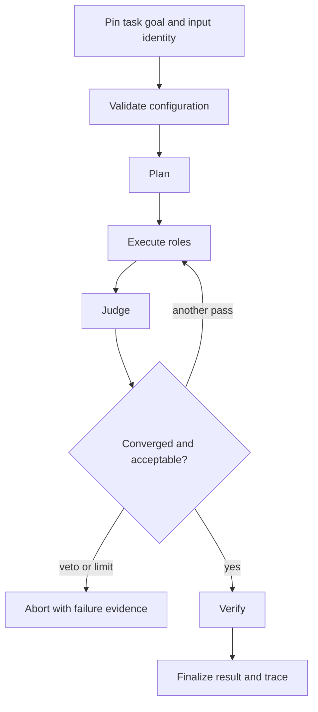

# Common Workflows

An agent run is an ordered decision process, not a collection of successful
role calls. Operate it by pinning the task and model contract, enforcing the
lifecycle, and preserving the trace that justifies the terminal outcome.

## Run a controlled document workflow

1. Give every run a single, testable task goal.
2. Pin the role list, quality threshold, maximum iterations, stage timeout,
   retry policy, and concurrency limit in YAML.
3. Set `model_metadata.provider`, `model_name`, `temperature`, and
   `max_tokens`. Use temperature `0.0` when replayability is claimed.
4. Send logs and results to governed artifact locations.
5. Review the final verdict together with confidence, epistemic status,
   convergence reason, and termination reason.
6. Retain `final_result.json` and `run_trace.json` as one evidence unit.

Processing a directory applies the same task to each resolved input. The CLI
records successful and failed files separately; one successful file must not
erase another file's failure.

## Tune convergence without hiding termination

Convergence is derived from ordered verdict and confidence history. Its
configuration includes stability window, required identical verdicts,
confidence tolerance, and strategy. The trace records a convergence hash and
reason so the decision to stop can be challenged later.

Keep these cases distinct:

- confidence or verdict stability justified completion;
- the maximum iteration limit stopped further work;
- a verification veto rejected the candidate outcome;
- a budget, timeout, resource limit, fatal failure, or user interruption
  aborted execution.

Do not translate the latter cases into a low-confidence success. Their failure
and stop metadata are part of the public result contract.

## Investigate a veto or aborted run

Read evidence in causal order:

1. lifecycle phase and last permitted transition;
2. role input, output, and failure classification;
3. judgment decision and scores;
4. convergence snapshot and hash;
5. verifier outcome and any veto;
6. termination reason and final trace completeness.

Transient, timeout, validation, and fatal failures have different retry
postures. Retry only when package policy classifies the failure as transient
and the configured budget permits another attempt. A trace missing mandatory
final evidence remains invalid even if a role produced usable text.

## Replay a delivered result

Production traces record input and config hashes, model identity and metadata,
prompt hashes, pipeline-definition identity, and applicable convergence
identity. The replay command reconstructs an outcome from the stored trace and
compares only verdict, confidence, epistemic status, and stop reason with the
adjacent final result. Its loader supplies defaults for some omitted replay
metadata and does not perform complete lifecycle validation.

A four-field match is only summary parity. Independently check schema and
runtime versions, replay status, hashes, lifecycle ordering, termination and
convergence data, field classifications, and retained input bytes. Model
sampling above zero is incompatible with a replayable label and must be
reported as such.

## Choose CLI or HTTP

Use the CLI for package configuration, provider-backed document workflows,
file batches, and durable final artifacts. Use HTTP for the fixed offline
`simple`/`extractive` pipeline and strict request/response integration. The HTTP
boundary writes its input and operational artifacts beneath `artifacts/api`;
the hosting process owns retention and isolation for that location.

The HTTP schema validates a narrow `config` object, but the current handler
resolves a fixed safe configuration rather than applying client overrides. Do
not claim arbitrary roles, providers, strategies, or backends through v1.

## Preserve the agent evidence set

Retain:

- task goal, input identity, and input hash;
- resolved pipeline configuration and config hash;
- pipeline-definition hash and contract version;
- provider, model, temperature, and token metadata;
- ordered trace entries, role failures, scores, and decisions;
- convergence snapshots, hash, and reason;
- verifier outcome, stop reason, and termination reason;
- final result, trace schema version, runtime version, and run fingerprint.

Together these records show not only what the agent returned, but why it was
allowed to stop and whether its outcome can be reconstructed.
