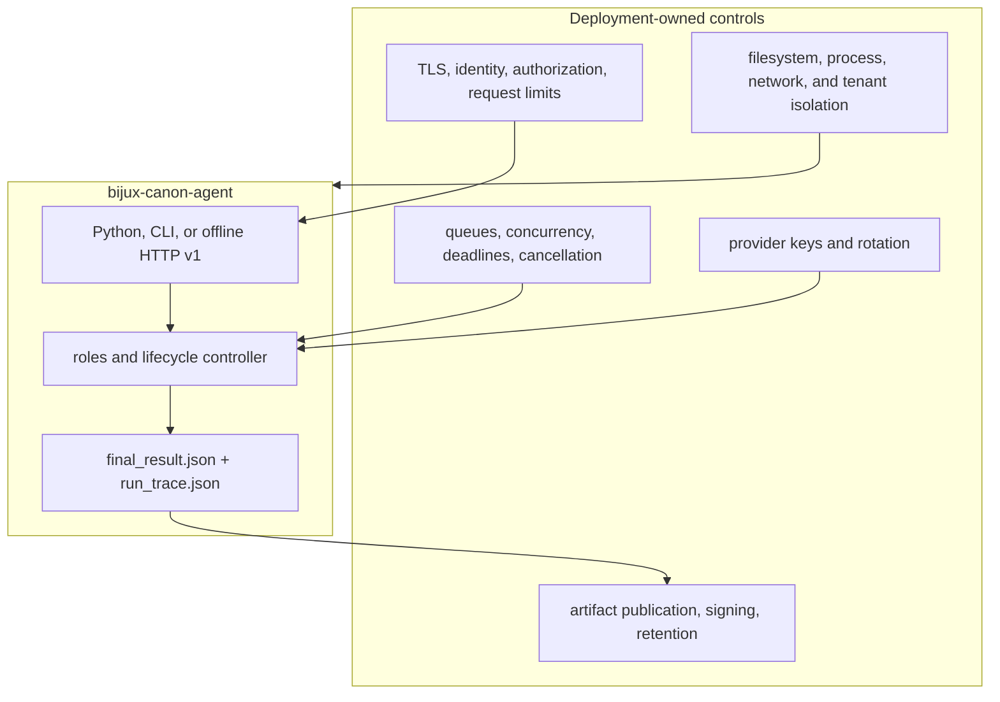

# Deployment Boundaries

Agent can run as an embedded pipeline, a provider-capable CLI, or a fixed
offline HTTP v1 application. These are distinct deployment postures. The
package owns orchestration evidence; the host owns network trust, provider
credentials, workload isolation, durable publication, and multi-tenant state.

## Responsibility boundary

## Deployment shapes

| Shape | Provider posture | Important boundary |
| --- | --- | --- |
| Embedded Python | Chosen by the host's composition | The caller owns adapter construction, resource cleanup, cancellation, and output publication |
| CLI | Can construct configured provider adapters | CLI bootstrap currently requires all registered provider keys even for help, dry-run, replay, or a single-provider run |
| HTTP v1 | Fixed offline `simple`/`extractive` execution | Request configuration does not select arbitrary providers, roles, models, backends, or filesystem paths |

Do not satisfy the CLI key check with committed dummy credentials. Treat it as
an availability constraint of that interface and use an appropriately
controlled environment.

## Artifact publication

The CLI writes `result/final_result.json` and, for a successful executed run,
`trace/run_trace.json`. The files are separate writes with no manifest,
signature, atomic directory publication, or completion marker. Always use a
fresh output root, validate both artifacts, confirm the trace path stays below
that root, and publish or sign the validated directory as one unit.

Directory input can produce several per-file outcomes while the primary final
artifact represents the first success. Batch services must retain the complete
per-file success and failure report rather than infer batch success from that
primary result.

## Production controls

A deployment supplies:

- TLS, authenticated identities, per-operation authorization, and rate limits;
- transport-level request byte limits before HTTP body collection;
- bounded concurrency, queue depth, stage deadlines, cancellation, and retry
  budgets for document and provider work;
- least-privilege input, output, log, and telemetry paths;
- provider secret injection and rotation without recording keys in YAML,
  prompts, errors, logs, results, or traces;
- egress policy and isolated execution for untrusted document parsers or
  custom providers;
- redaction policy for source text, prompts, model output, paths, and exception
  detail;
- durable artifact publication, external integrity protection, backup,
  retention, and tenant-specific namespaces;
- monitoring for role failure, veto, retry exhaustion, convergence state,
  resource exhaustion, trace validation failure, and result/trace mismatch.

## Operational acceptance

Test each selected interface independently. For CLI deployments, verify key
bootstrap, file and directory behavior, provider failure, partial batch
outcomes, and interrupted writes. For HTTP, verify that gateway controls apply
before application parsing and that request configuration cannot escape the
offline contract. For all shapes, validate lifecycle, reconstruct the result
from the trace, and exercise replay without provider access.

The [artifact contract](../interfaces/artifact-contracts.md) gives the complete
publication procedure. The [security guide](security-and-safety.md) describes
credential, document, logging, and HTTP risks.
