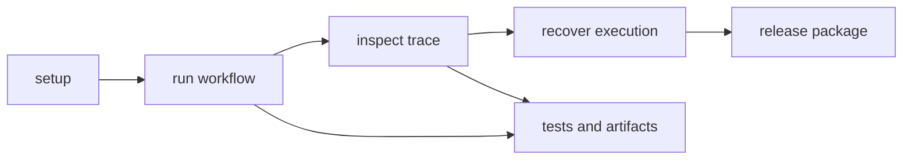

# Operations

Open this section when you need to run agent work repeatably: install it, exercise workflows, diagnose trace drift, release it, or recover from failure without relying on who last touched the package.

## Operating Loop

Agent operations should make workflow behavior teachable from the repository.
A maintainer needs one path to execute a flow, inspect the emitted trace, and
recover when orchestration drifts, without depending on whoever most recently
debugged the package.

## Read These First

- open [Installation and Setup](https://bijux.io/bijux-canon/05-bijux-canon-agent/operations/installation-and-setup/) first when you need a clean package starting point
- open [Observability and Diagnostics](https://bijux.io/bijux-canon/05-bijux-canon-agent/operations/observability-and-diagnostics/) when workflow traces or outputs no longer match expectation
- open [Failure Recovery](https://bijux.io/bijux-canon/05-bijux-canon-agent/operations/failure-recovery/) when workflow execution has already gone wrong

## Operational Risk

The main operational risk here is letting orchestration succeed only for people who already know the unwritten workflow path.

## First Proof Check

- `pyproject.toml`, `README.md`, and package-local entrypoints for checked-in operating truth
- `tests` and runnable workflows for evidence that the package can be operated repeatably
- release notes and version metadata when the work changes caller expectations

## Pages In This Section

- [Installation and Setup](https://bijux.io/bijux-canon/05-bijux-canon-agent/operations/installation-and-setup/)
- [Local Development](https://bijux.io/bijux-canon/05-bijux-canon-agent/operations/local-development/)
- [Common Workflows](https://bijux.io/bijux-canon/05-bijux-canon-agent/operations/common-workflows/)
- [Observability and Diagnostics](https://bijux.io/bijux-canon/05-bijux-canon-agent/operations/observability-and-diagnostics/)
- [Performance and Scaling](https://bijux.io/bijux-canon/05-bijux-canon-agent/operations/performance-and-scaling/)
- [Failure Recovery](https://bijux.io/bijux-canon/05-bijux-canon-agent/operations/failure-recovery/)
- [Release and Versioning](https://bijux.io/bijux-canon/05-bijux-canon-agent/operations/release-and-versioning/)
- [Security and Safety](https://bijux.io/bijux-canon/05-bijux-canon-agent/operations/security-and-safety/)
- [Deployment Boundaries](https://bijux.io/bijux-canon/05-bijux-canon-agent/operations/deployment-boundaries/)

## Leave This Section When

- leave for [Interfaces](https://bijux.io/bijux-canon/05-bijux-canon-agent/interfaces/) when the live problem is contract shape rather than package operation
- leave for [Architecture](https://bijux.io/bijux-canon/05-bijux-canon-agent/architecture/) when a workflow problem exposes structural drift underneath it
- leave for [Quality](https://bijux.io/bijux-canon/05-bijux-canon-agent/quality/) when the package runs but the real question is whether the evidence is strong enough

## Design Pressure

If workflow recovery depends on tribal knowledge about trace interpretation,
the package is not operationally ready. This section has to turn agent
execution into a repeatable, inspectable routine.
