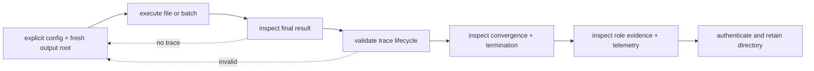

# Operations

Operate an agent pipeline from terminal evidence backward. Begin with the
published decision and termination state, validate the trace and its lifecycle,
then inspect convergence, role output, and logs. A single successful process
exit or plausible final artifact is not enough.

## Operating lifecycle

```mermaid
flowchart LR
    prepare["explicit config + fresh output root"]
    run["execute file or batch"]
    result["inspect final result"]
    trace["validate trace lifecycle"]
    convergence["inspect convergence + termination"]
    roles["inspect role evidence + telemetry"]
    publish["authenticate and retain directory"]

    prepare --> run --> result --> trace --> convergence --> roles --> publish
    result -. no trace .-> prepare
    trace -. invalid .-> prepare
```

## Preflight facts

- The current CLI validates all four registered provider credentials before it
  parses any command, including help, dry run, and replay. This is an
  implementation constraint, not a recommendation to over-provision keys.
- Use the maintained YAML file by explicit path. A missing configuration can
  degrade to an empty mapping, while non-dry trace production still requires
  model metadata.
- Use a fresh output root for every run. Fixed filenames can overwrite or mix
  evidence from an earlier execution.
- A directory input processes immediate regular files only; it is not a
  recursive corpus traversal.

## Evidence order

| Evidence | Question |
| --- | --- |
| `result/final_result.json` | What verdict, epistemic state, convergence, termination, and trace path were published? |
| `trace/run_trace.json` | Which pipeline, configuration, input, model, prompt, lifecycle, and decision records support it? |
| persisted pipeline result | Which stages, shards, revisions, warnings, action plan, audit events, and telemetry occurred? |
| structured logs and counters | Which role or lifecycle boundary explains the retained outcome? |

## Incident routing

| Symptom | Inspect first | Safe response |
| --- | --- | --- |
| Exit `0` but inputs failed | batch success/failure records and published fallback | accept only explicit artifact semantics; do not use exit status as batch truth |
| Summary has no trace | dry-run or no-primary-success path | treat as veto without execution evidence |
| Replay prints `MISMATCH` but exits successfully | the four compared fields and all unexamined trace evidence | fail downstream acceptance explicitly and investigate the full trace |
| Convergence looks successful but result is weak | strategy, window hash, verdict history, epistemic verdict, termination | evaluate correctness separately; stability is not truth |
| Provider behavior drifted | provider/model/version, temperature, prompt/model hashes, input and runtime fingerprints | classify the changed evidence; do not claim historical re-execution |
| Trace and result disagree | schema upgrade, lifecycle validation, trace reconstruction, stale fixed-name files | quarantine the directory and rerun into a fresh root |
| Role failed last | execution path, shard merge, and final validation | recover the owning boundary rather than bypassing orchestration order |

## Deployment boundary

The package is not a sandbox, distributed scheduler, secrets manager, durable
multi-host event store, or tenant-isolation layer. The HTTP adapter also lacks
independent authentication, rate limiting, body-size enforcement, and artifact
lookup. Hosts own filesystem access, network policy, provider limits,
cancellation, concurrency, credential scope, retention, and external artifact
authentication.

## Operate by need

| Need | Guide |
| --- | --- |
| Install extras and satisfy current entrypoint preconditions | [Installation and setup](installation-and-setup.md) |
| Develop with isolated configuration and artifacts | [Local development](local-development.md) |
| Run the canonical file and replay journeys | [Common workflows](common-workflows.md) |
| Diagnose lifecycle, convergence, and provider drift | [Observability and diagnostics](observability-and-diagnostics.md) |
| Plan sharding, provider, and resource behavior | [Performance and scaling](performance-and-scaling.md) |
| Recover failed or inconsistent outputs | [Failure recovery](failure-recovery.md) |
| Define hosting and credential controls | [Security and safety](security-and-safety.md) and [Deployment boundaries](deployment-boundaries.md) |
| Release a trace- or contract-sensitive change | [Release and versioning](release-and-versioning.md) |
