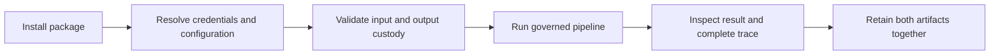

# Installation and Setup

`bijux-canon-agent` supports Python 3.11 through 3.14. The base distribution
includes the orchestration pipeline, CLI, OpenAI adapter, structured contracts,
trace support, and YAML configuration.



## Install

```bash
python -m venv .venv
source .venv/bin/activate
python -m pip install --upgrade pip
python -m pip install bijux-canon-agent
```

The package root intentionally exposes only `API_VERSION`, so verify the
distribution and an owned contract module:

```bash
python -c "from bijux_canon_agent import API_VERSION; print(API_VERSION)"
python -c "from bijux_canon_agent.contracts.runtime_models import AgentInput; print(AgentInput)"
```

## Account for CLI Credential Validation

Before the CLI parses `--help`, `--version`, `run`, `--dry-run`, or `replay`, it
currently requires all of these variables to be non-empty:

- `OPENAI_API_KEY`
- `ANTHROPIC_API_KEY`
- `HUGGINGFACE_API_KEY`
- `DEEPSEEK_API_KEY`

Load real credentials from the deployment's approved secret manager. The
optional `env` extra adds `.env` loading support:

```bash
python -m pip install 'bijux-canon-agent[env]'
bijux-canon-agent --help
```

Do not commit `.env` or place secrets in the YAML pipeline configuration. This
all-provider check is a current CLI bootstrap limitation; a selected workflow
may use only one provider or the local pipeline.

## Create a Configuration

Save a controlled configuration as `agent.yml`:

```yaml
task_goal: summarize this document without unsupported claims

pipeline:
  parameters:
    max_retries: 2
    max_iterations: 3
    concurrency_limit: 4
    stage_timeout: 120.0
    quality_threshold: 0.8
  policy:
    retry_allowed: true

logging:
  log_dir: artifacts/bijux-canon-agent/logs
  log_level: INFO
  structured_logging: true

model_metadata:
  provider: local
  model_name: auditable-doc-pipeline
  temperature: 0.0
  max_tokens: 512
```

`model_metadata` is required when the CLI writes a final trace. Temperature
must be exactly `0.0` for a replayable classification.

## Run into a Fresh Output Directory

```bash
mkdir -p artifacts/bijux-canon-agent/input
cp report.txt artifacts/bijux-canon-agent/input/report.txt

bijux-canon-agent run artifacts/bijux-canon-agent/input/report.txt \
  --config agent.yml \
  --out artifacts/bijux-canon-agent/runs/report-17
```

On a successful non-dry execution, inspect both:

```text
artifacts/bijux-canon-agent/runs/report-17/result/final_result.json
artifacts/bijux-canon-agent/runs/report-17/trace/run_trace.json
```

The package does not atomically commit this pair. Do not reuse the directory
for a retry; choose a new run path and preserve the earlier failure evidence.

## Use the Offline HTTP Boundary

The v1 API requires FastAPI but does not use the CLI bootstrap or accept
provider selection from clients:

```bash
python -m pip install 'bijux-canon-agent[api]' uvicorn
uvicorn bijux_canon_agent.api.v1.app:create_app \
  --factory --host 127.0.0.1 --port 8000
curl --fail-with-body http://127.0.0.1:8000/v1/health
```

## Repository Checkout

```bash
make install
make -f makes/packages/bijux-canon-agent.mk \
  -C packages/bijux-canon-agent help
make test PACKAGE=bijux-canon-agent
```

Package Makefiles are repository profiles under `makes/packages/`; the package
directory does not contain a standalone Makefile. Use the root dispatcher for
normal checks and the explicit profile form when inspecting package targets.

Use `make docs-check` for handbook changes and widen validation only for
contracts that cross package or API boundaries.

## Setup Checklist

- Canonical imports resolve from the expected environment.
- CLI credentials come from approved secret storage and are not committed.
- Configuration pins task, limits, model metadata, and deterministic posture.
- Every material execution receives a fresh, access-controlled output root.
- Final result and trace are retained and validated together.

Continue with [state and persistence](../architecture/state-and-persistence.md)
and [configuration](../interfaces/configuration-surface.md).
