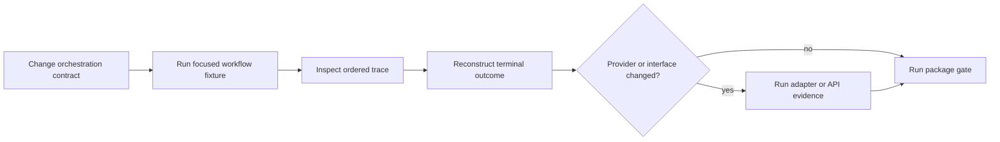

# Local Development

Develop agent behavior as a causal workflow. A final response is insufficient
evidence: the useful local loop proves which role acted, which lifecycle
transition authorized it, which provider configuration applied, what was
recorded, and why the controller stopped.



## Bootstrap from the repository root

```bash
make install
make -f "$PWD/makes/packages/bijux-canon-agent.mk" \
  -C packages/bijux-canon-agent help
```

Run normal gates through root dispatch:

```bash
make test PACKAGE=bijux-canon-agent
make lint PACKAGE=bijux-canon-agent
make quality PACKAGE=bijux-canon-agent
```

The package profile provisions the canonical environment under
`artifacts/bijux-canon-agent/venv`; `packages/bijux-canon-agent/.venv` is a
convenience link to it. Reports remain under `artifacts/`. There is no
package-local Makefile; direct invocation requires the absolute repository
profile path because Make applies `-C` before resolving `-f`.

## Start with the nearest workflow invariant

```bash
packages/bijux-canon-agent/.venv/bin/python -m pytest \
  packages/bijux-canon-agent/tests/<area>/<test-file>.py -q
```

| Changed behavior | Evidence to inspect |
| --- | --- |
| role contract | typed input, typed success, veto, error, and handoff serialization |
| lifecycle controller | allowed transition, forbidden transition, abort, and terminal state |
| merge or judgment | input lineage, score, issues, action plan, decision, and confidence |
| convergence | window, strategy, verdict history, stable stop reason, and non-convergence |
| provider adapter | selected provider/model, parameters, timeout, usage, failure, and redaction |
| retry or fallback | attempt order, budget, provider change, error evidence, and final classification |
| trace | header, ordered entries, hashes, observational exclusions, and completeness |
| finalization | parity between trace-derived outcome and `final_result.json` |

Use local or stub providers for deterministic contract work. Live-provider
tests answer connectivity and integration questions; they cannot establish
historical replay or answer correctness.

## Handle credentials without weakening tests

The current CLI bootstrap checks all supported provider credential variables
before command dispatch, including help and replay. Tests should supply
controlled non-secret values or bypass the CLI at an owned lower interface.
Never place live keys in fixtures, YAML, traces, logs, snapshots, or committed
environment files.

Provider tests must prove redaction and failure behavior. A successful call is
not sufficient when a timeout, rate limit, malformed response, or provider
fallback can change workflow control.

## Validate public surfaces deliberately

For HTTP or OpenAPI changes:

```bash
make api PACKAGE=bijux-canon-agent
```

The v1 HTTP application uses a fixed offline pipeline. Do not claim parity with
the provider-configurable CLI beyond their shared typed outcome contract.

For entry points, root imports, package data, extras, or distribution metadata:

```bash
make build PACKAGE=bijux-canon-agent
```

Use `make docs-check` when role, trace, convergence, provider, artifact, or
replay terminology changes.

## Read the Package Evidence

| Surface | Repository evidence |
| --- | --- |
| focused and package tests | `artifacts/bijux-canon-agent/test/` |
| API schema and contract checks | `artifacts/bijux-canon-agent/api/` |
| wheel and source archive checks | `artifacts/bijux-canon-agent/build/` |
| software bill of materials | `artifacts/bijux-canon-agent/sbom/` |
| workflow fixtures | the fixture-specific output directory under `artifacts/` |

The HTTP evidence covers the fixed offline application and its published
schema. Provider-adapter evidence belongs to focused adapter tests or an
explicit live integration run; an API report does not establish parity with
the provider-configurable CLI.

## Preserve result and trace together

Every material fixture should retain the pipeline definition, resolved
configuration hash, provider metadata, ordered trace, terminal outcome, stop
reason, termination reason, confidence, and epistemic verdict. The result and
trace must reconcile even for veto, abort, partial failure, and dry-run paths.

`final_result.json` names its trace path. Resolve that path within the same run
directory, reconstruct the terminal outcome from the trace, and compare the
verdict, confidence, epistemic status, stop reason, and termination reason.
Missing or divergent records are failed custody, not a successful run with a
documentation exception.

See [change validation](../quality/change-validation.md) and
[artifact contracts](../interfaces/artifact-contracts.md) for the evidence
expected at review.
