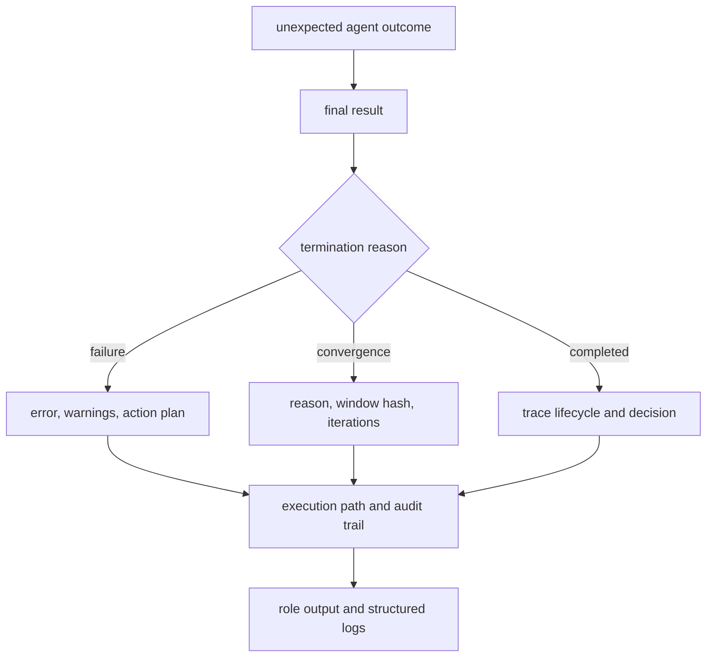

# Observability and Diagnostics

Diagnose agent runs from terminal evidence back toward individual roles. The
final status and trace identify the failed boundary more reliably than a single
log message from one agent.

## Evidence Order

1. Read `result/final_result.json` for verdict, termination, convergence, and
   trace location.
2. Read `trace/run_trace.json` for configuration, pipeline, model, prompt,
   runtime, and convergence hashes.
3. Inspect the persisted pipeline result for stages, audit trail, revisions,
   execution path, warnings, and telemetry.
4. Use structured logs and counters to narrow the responsible lifecycle and
   role only after the artifact record is understood.

## Reading Terminal State

| Signal | Interpretation |
| --- | --- |
| `success: false` with `failure` | execution or final validation failed |
| `user_abort` | caller interrupted a governed boundary |
| `resource_exhaustion` | a budget or runtime resource ended execution |
| `convergence` | policy ended the run from retained convergence evidence |
| verdict `VETO` | substantive rejection; not necessarily an execution failure |
| `cache_hit: true` | result came from the context-derived cache key |

Keep termination, verdict, epistemic status, and stop reason separate during
triage. Combining them into a generic failure label destroys useful evidence.

## Metrics and Logs

Pipeline telemetry reports iterations, stages executed, shards processed, and
total duration. Operational counters distinguish executions, errors, cache
hits, cache stores, input-validation failures, generated cache keys, and
progress-callback registration. Tags include the stage and terminal success
state where relevant.

Logs carry structured context such as context ID, task goal, required stages,
shard number, validation issues, cache key, and completion totals. Provider
credentials and full sensitive payloads do not belong in diagnostic exports.

Progress callbacks are observational. Callback failures are logged, but they do
not redefine the pipeline result. Treat a callback error as an observability
incident unless the underlying execution artifact also failed.

## Replay Mismatch Triage

Compare deterministic fields in this order:

1. pipeline definition and contract version;
2. configuration and input hashes;
3. provider, model, temperature, and runtime version;
4. prompt and model hashes on the final entry;
5. convergence hash and reason; and
6. decision, confidence, stop reason, and epistemic verdict.

The replay classifier maps changed decision to model drift, changed confidence
to prompt drift, changed stop reason to configuration drift, and changed
epistemic verdict to a non-deterministic-field mismatch. These categories guide
investigation; the underlying hashes remain the stronger evidence.

## Failure Evidence

A standardized failure result includes an audit event, failed terminal status,
warning, zeroed telemetry, error text, and action plan. Preserve that complete
shape. Retrying only the role that logged last can bypass the stage ordering,
shard merge, or final validation that actually rejected the run.

Recovery is complete when the new execution has a coherent terminal status,
its trace passes lifecycle and replay-field validation, and any replay claim is
consistent with the recorded model temperature and convergence identity.
