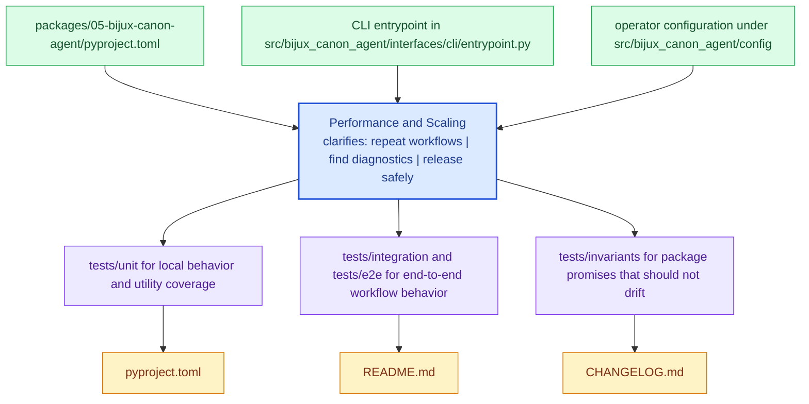

# Performance and Scaling

Performance work should preserve the deterministic and contract-driven behavior the package already promises.

This page keeps optimization work honest. A package is not healthier if it gets
faster by becoming harder to reason about, harder to replay, or easier to break
for downstream readers.

Treat the operations pages for `bijux-canon-agent` as the package's explicit operating memory. They should make common tasks repeatable without relearning the workflow from logs or oral history.

## Visual Summary

## Performance Review Anchors

- inspect workflow modules before optimizing boundary code blindly
- use the package tests that exercise realistic workloads
- treat artifact and contract drift as a regression even when performance improves

## Test Anchors

- tests/unit for local behavior and utility coverage
- tests/integration and tests/e2e for end-to-end workflow behavior
- tests/invariants for package promises that should not drift
- tests/api for HTTP-facing validation

## Concrete Anchors

- `packages/05-bijux-canon-agent/pyproject.toml` for package metadata
- `packages/05-bijux-canon-agent/README.md` for local package framing
- `packages/05-bijux-canon-agent/tests` for executable operational backstops

## Use This Page When

- you are installing, running, diagnosing, or releasing the package
- you need repeatable operational anchors rather than architectural framing
- you are responding to package behavior in local work, CI, or incident pressure

## Decision Rule

Use `Performance and Scaling` to decide whether a maintainer can repeat the package workflow from checked-in assets instead of memory. If a step works only because someone already knows the trick, the workflow is not documented clearly enough yet.

## What This Page Answers

- how `bijux-canon-agent` is installed, run, diagnosed, and released in practice
- which checked-in files and tests anchor the operational story
- where a maintainer should look first when the package behaves differently

## Reviewer Lens

- verify that setup, workflow, and release statements still match package metadata and current commands
- check that operational guidance still points at real diagnostics and validation paths
- confirm that maintainer advice still works under current local and CI expectations

## Honesty Boundary

This page explains how `bijux-canon-agent` is expected to be operated, but it does not replace package metadata, actual runtime behavior, or validation in a real environment. A workflow is only trustworthy if a maintainer can still repeat it from the checked-in assets named here.

## Next Checks

- move to interfaces when the operational path depends on a specific surface contract
- move to quality when the question becomes whether the workflow is sufficiently proven
- move back to architecture when operational complexity suggests a structural problem

## Purpose

This page records the posture for performance work in `bijux-canon-agent`.

## Stability

Keep it aligned with the package's actual performance-sensitive paths and validation surfaces.
