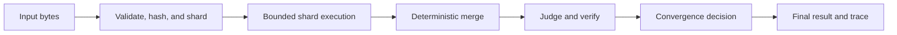

# Performance and Scaling

`bijux-canon-agent` scales a governed workflow, not an unordered pool of model
calls. The controller must retain lifecycle order, shard identity, role
outputs, judgment, verification, convergence evidence, and the final trace as
work grows.

```mermaid
flowchart LR
    input[Input bytes] --> prepare[Validate, hash, and shard]
    prepare --> execute[Bounded shard execution]
    execute --> merge[Deterministic merge]
    merge --> judge[Judge and verify]
    judge --> converge[Convergence decision]
    converge --> persist[Final result and trace]
```

Throughput gains are valid only when the same input and configuration produce
the same governed ordering and replay identity. Skipping judgment,
verification, or trace construction changes the contract.

## Cost Model

| Work | Dominant scale variable | Retained evidence |
| --- | --- | --- |
| preparation | input bytes and file count | context ID, input/configuration hashes |
| chunking | bytes divided by `chunk_size` | chunk and processing metadata |
| sharding | bytes beyond `shard_threshold` | shard count and execution path |
| role execution | stages × shards × attempts | role output, audit, revisions, warnings |
| provider calls | prompt and response tokens, retries | model and prompt identity, failure data |
| convergence | iterations and history window | reason, decision type, window hash |
| merge and final validation | shard outputs and quality checks | merged stages and final status |
| persistence | trace and result bytes | `run_trace.json`, `final_result.json` |

End-to-end duration can be dominated by a single slow provider, but local work
still grows with every shard, lifecycle stage, retry, and convergence
iteration. Report the distribution of shard and stage durations rather than a
single average that hides the straggler controlling total latency.

## Governing Knobs

The default pipeline settings establish bounded behaviour:

| Setting | Default | Performance effect |
| --- | ---: | --- |
| `chunk_size` | `1000` | smaller values create more processing units and overhead |
| `shard_threshold` | `1000000` | lower values shard earlier and increase merge work |
| `concurrency_limit` | `10` | caps simultaneous shard execution |
| `stage_timeout` | `300.0` | bounds each stage wait, not the complete pipeline |
| `max_retries` | `2` | bounds retryable pipeline work |
| `retry_delay` | `1.0` | base delay before repeated work |
| `max_iterations` | `3` | caps convergence cycles |
| `quality_threshold` | `0.8` | controls acceptance during merge and finalization |

These settings interact. Smaller shards with high concurrency can reduce
latency until provider quotas, memory, serialization, or merge work becomes
the bottleneck. More retries multiply the worst-case stage time. More
iterations can improve a result or establish convergence, but also repeat role
and provider work.

Tune one interaction at a time with the resolved configuration retained in the
trace. Contradictory settings, such as retry behaviour with no allowed retry,
are rejected rather than silently reinterpreted.

## Concurrency Without Lifecycle Drift

Concurrency belongs inside an execution boundary. The controller still owns
the canonical sequence:

`INIT → PLAN → EXECUTE → JUDGE → VERIFY → FINALIZE → DONE`

Roles cannot advance this lifecycle independently. Shards may execute
concurrently during governed work, but each result must retain shard identity
and merge deterministically before judgment and verification. The completion
order of provider calls must not become the semantic order of the trace.

Choose `concurrency_limit` from measured provider quota, response size, local
memory, and merge pressure. A limit higher than the number of independent
shards adds no parallelism; a limit above provider capacity creates throttling
and retries that often make the run slower.

## Cache Semantics

The pipeline cache key is derived from the sorted input context while excluding
observational `timestamp` and `nonce` fields. A cache hit is explicit in the
result. Treat cache-hit and cache-miss latency as separate populations.

A cache is correct only while every semantic input is represented in its key
or surrounding cache namespace. Model, prompt, policy, provider, source, or
package changes that are not captured by the integration require invalidation.
Never present a cached result as a new provider execution, and do not hide
cache state when comparing performance.

The built-in caches are process-local. Multi-process or multi-host deployments
need an external cache with explicit tenant isolation, versioned namespaces,
retention, and stampede control.

## Benchmark Contract

A useful benchmark record contains:

1. exact input bytes or their stable digest, task goal, and resolved
   configuration;
2. pipeline definition, contract version, package/runtime version, provider,
   model, prompt identity, and temperature;
3. file count, input bytes, chunk count, shard count, stages, iterations,
   provider calls, retries, and cache state;
4. preparation, per-stage, provider, merge, judgment, verification,
   finalization, and persistence timings;
5. median and tail latency across repeated runs, plus peak memory and output
   bytes where those limits matter;
6. decision, confidence, quality score, termination reason, convergence reason,
   warnings, and replay-field comparison.

Compare like with like: cold and warm cache runs, single-file and directory
runs, deterministic and sampled models, and local and remote providers answer
different questions. A faster run with a different verdict or failed final
validation is not a performance win.

## Deployment Scaling

The CLI processes files and retains pipeline state in one process. Its final
result and trace use fixed filenames in a caller-selected output root. Scale
independent inputs through an external scheduler, give every execution a fresh
output directory, and keep provider concurrency bounded across workers.

The package does not provide a distributed queue, shared run database,
cross-process cache, atomic artifact commit, or multi-writer coordination.
Deployments that need horizontal scaling must supply those controls and retain
one authoritative controller and evidence pair per run.

## Optimization Order

- Remove unintended cache misses and repeated provider work before raising
  concurrency.
- Profile chunk and shard geometry before lowering thresholds globally.
- Attribute retries to transient failure, throttling, or timeout before
  increasing `max_retries`.
- Inspect convergence history before increasing `max_iterations`.
- Keep judgment, verification, lifecycle validation, and artifact writing in
  every production benchmark.

See [Configuration Surface](../interfaces/configuration-surface.md) for the
validated settings, [Execution Model](../architecture/execution-model.md) for
controller ownership, and [Observability and Diagnostics](observability-and-diagnostics.md)
for the measurements retained by a run.
